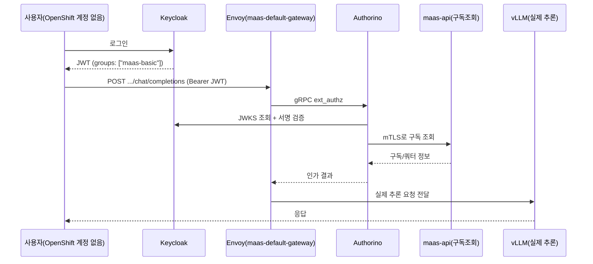

# 시나리오 17: MaaS 외부 OIDC 인증

**모듈:** 서빙 및 추론 > MaaS
**지원 단계:** GA (RHOAI 3.5)
**관련 컴포넌트:** MaaS Gateway, Authorino, Keycloak

## 목적

OpenShift 계정이 없는 외부 사용자/앱이 별도 IDP(Keycloak)에서 받은 OIDC 토큰만으로 MaaS API를 호출할
수 있는지 검증한다. IDP 쪽 그룹(`maas-basic`/`maas-premium`)이 MaaS 구독/쿼터에 그대로 반영되는지도
함께 확인한다.

**시사점**: 이게 되면 MaaS가 "OpenShift 클러스터 계정을 가진 사람만 쓰는 사내 도구"에서 "외부에
내어줄 수 있는 서비스"로 바뀐다. 조직 관리도 이원화 안 되고(IDP 그룹만 관리하면 MaaS 쿼터가 따라옴),
기존 사내 SSO를 그대로 재사용할 수 있다.

## 요청 흐름



`/v1/models`(카탈로그 조회)는 Authorino 인가 후 Envoy가 `maas-api`로 직접 응답하고, vLLM을 거치지
않는다 — 실제 추론이 필요한 경로(`/<ns>/<model>/v1/...`)만 vLLM까지 간다.

## 사전 조건

| 구성 요소 | 필요한 상태 |
|---|---|
| `DataScienceCluster` (RHOAI 3.5) | Ready — `openshift-aws-harness/harness.sh rhoai` |
| MaaS Gateway (RHCL/Kuadrant + `aigateway` 컴포넌트) | Ready — `openshift-ai-maas-demo/harness.sh maas-up` |
| 외부 IDP | **Red Hat build of Keycloak(RHBK)** Operator로 클러스터 내부에 직접 구축 (Bitnami/별도 VM 아님) |

## 절차

```sh
cd openshift-ai-maas-demo/harness

./harness.sh maas-up                         # RHCL(Kuadrant)+Authorino+Gateways+Postgres+dashboard flags -- 한 번만
./harness.sh scenario17-keycloak-up          # RHBK 오퍼레이터 + Keycloak 인스턴스
./harness.sh scenario17-keycloak-realm       # realm + 그룹 2개 + 유저 2명 + OIDC 클라이언트
./harness.sh scenario17-keycloak-token-test  # Keycloak 단독 검증 (토큰에 groups 클레임 확인)
./harness.sh scenario17-wire-authpolicy      # Authorino가 Keycloak을 신뢰하도록 연결
./harness.sh scenario17-authorino-trust-ca   # Authorino가 라우터 CA(Keycloak)+service-ca(maas-api mTLS) 신뢰하도록

MODEL_NAMESPACE=maas-demo MODEL_NAME=maas-demo-model \
  MODEL_URI="hf://Qwen/Qwen2.5-1.5B-Instruct" \
  ./harness.sh scenario18-deploy-model        # 모델 배포 + MaaSSubscription/MaaSAuthPolicy 그룹별 등록까지 한 번에

bash ./local/scenario17-manual-test.sh       # 검증 (노트북에서 SSH 없이 바로 실행)
```

## 실측 결과 (2026-09-23)

`GET /v1/models`와 `POST .../v1/chat/completions` 모두 HTTP 200 (토큰 없으면 401) — Keycloak
사용자가 OpenShift 계정 없이 인증부터 실제 vLLM 추론까지 성공. `local/scenario17-manual-test.sh`로
재현 가능.

RHOAI 3.5 기본 설치에서 버그 4개 발견, 전부 `harness/remote/maas-up.sh` /
`scenario17-authorino-trust-ca.sh`에 자동화됨 — `DataScienceCluster` API 필드 개명, `Gateway`
TLS 설정 누락, `odh-model-controller`와의 `AuthPolicy` 소유권 충돌, Authorino→`maas-api` mTLS
인증서 미신뢰. 원인 분석·재현 로그는 `lessonlearn.md` 참고.

## 남은 작업

- Group Mapping → 실제 쿼터 차등 적용(`maas-basic` 100 vs `maas-premium` 100000 토큰/시간) 검증
