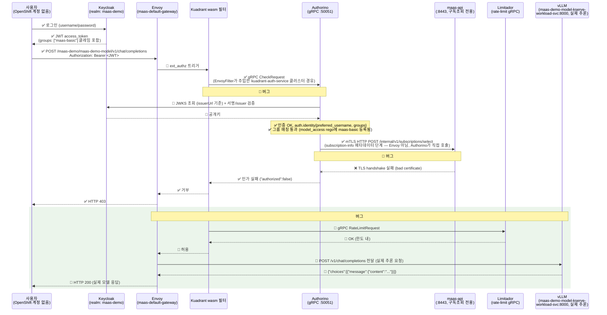

# 시나리오 17: MaaS 외부 OIDC 인증

**모듈:** 서빙 및 추론 > MaaS
**지원 단계:** GA (RHOAI 3.5)
**관련 컴포넌트:** MaaS Gateway, Authorino, 외부 OIDC IDP(Keycloak/Okta 등)

> **TL;DR (2026-09-22 기준)**: Keycloak 로그인 → `/v1/models` 조회까지는 완전히 동작 확인됨
> (OpenShift 계정 없는 사용자가 실제로 인증 통과, `harness/local/scenario17-manual-test.sh`로 직접
> 재현 가능). **실제 채팅 완성 호출은 아직 403** — `Authorino → maas-api` mTLS 문제(8번 섹션) 미해결.
> 이 세션에서 겪은 4개 TLS/정책 문제 중 3개는 harness 스크립트에 자동 반영해서 다음 설치부터는 수동
> 개입 없이 재현됨 (아래 "절차" 참고) — 4번째(mTLS)만 아직 사람이 손대야 함.
## 목적

지금까지의 MaaS 인증(시나리오 13 등)은 `oc whoami -t`로 뽑은 **OpenShift 자체 토큰**을 그대로 Bearer
토큰으로 썼다 — 즉 호출자가 반드시 OpenShift 계정을 갖고 있어야 했다. 이 시나리오는 **OpenShift 계정이
없는 외부 사용자/앱**이 별도 IDP(Keycloak, Okta 등)에서 발급받은 OIDC 토큰만으로 MaaS API를 호출할 수
있는지 검증한다. 추가로 **OIDC Group Mapping**을 통해, IDP 쪽 그룹(예: `maas-basic-tier`,
`maas-premium-tier`)이 MaaS의 구독/쿼터 정책에 그대로 반영되는지도 함께 확인한다.

이건 RHOAI 3.4까지의 `oc` 토큰 기반 흐름과 근본적으로 다른 인증 경로라서, Authorino의
`AuthConfig`/`AuthPolicy`에 OpenShift `TokenReview` 대신(또는 병행) **외부 OIDC issuer 검증**이 추가로
붙는 구조일 것으로 예상된다 — 정확한 CR 스키마는 실측 단계에서 확인 필요.

## 시사점 — 이게 되면 뭐가 좋아지나

- **MaaS가 진짜 "사내용"에서 "외부 제공 서비스"로 넘어간다.** 3.4까지는 호출자가 반드시 이 OpenShift
  클러스터의 계정을 가져야 했다 — 사실상 클러스터 운영팀 내부에서만 쓸 수 있었다는 뜻. 외부 IDP를 붙일
  수 있으면 파트너사, 다른 사업부, 사내 다른 시스템의 서비스 계정 등 **이 클러스터와 아무 관계 없는
  주체**에게도 모델을 API로 팔거나 내어줄 수 있다. "Models-as-a-**Service**"라는 이름값을 이 기능이
  비로소 채운다.
- **사용자/권한 관리가 이원화되지 않는다.** OIDC Group Mapping이 되면, 새 사람이 조직에 들어오거나
  나갈 때 **IDP 쪽 그룹만 관리**하면 MaaS 쪽 쿼터/구독이 자동으로 따라온다. 이게 없으면 IDP 따로,
  MaaS 구독 목록 따로 — 조직 변경마다 두 군데를 수동으로 맞춰야 하고, 둘이 어긋나는(온보딩 지연,
  오프보딩 누락) 사고가 나기 쉽다.
- **기존 사내 SSO 투자를 재사용한다.** 이미 Keycloak/Okta로 SSO를 굴리고 있는 조직이라면, MaaS 전용
  계정 체계를 새로 만들 필요 없이 그 IDP에 얹기만 하면 된다 — 신규 인프라가 아니라 기존 것의 확장.

## 요청 흐름 (사용자 → 최종 백엔드)

사용자 로그인부터 `maas-api` 백엔드 응답까지 하나의 그림으로 통일. "MaaS Gateway"를 블랙박스로 두지
않고 내부(Envoy + Kuadrant wasm 필터 + Authorino/Limitador gRPC)까지 다 펼쳤다 — 이번에 겪은 버그
(아래 "6) 근본 원인" 참고)가 정확히 어느 화살표에서 났는지 그대로 보여주기 위해서다.

**주의**: 화살표마다 검증 수준이 다르다 — ✅는 실제 로그/응답으로 직접 확인, 💭는 설정(CR/코드)을
읽고 "이렇게 동작해야 한다"고 판단했지만 실행 로그로 직접 못 본 것. 아래 "로그 증거" 절에 실제 로그
원문을 붙여놨다.

이 그림은 **실제 채팅 완성 호출**(`POST /<ns>/<model>/v1/chat/completions`) 기준이다 — 최종적으로
도달해야 하는 건 `maas-api`가 아니라 **vLLM**이다. `maas-api`는 모델 카탈로그(`/v1/models`)를 직접
서빙하기도 하지만, 채팅 완성 요청에서는 **Authorino가 인가 판단 도중 내부적으로 한 번 더 불러쓰는
"구독 조회" 백엔드**일 뿐이고 실제 추론과는 무관하다 — 처음 그렸을 때 이 둘을 하나로 뭉뚱그려서
vLLM이 빠져 있었다.



참고로 `GET /v1/models`(모델 카탈로그 조회, 시나리오 17 절차 3번)는 채팅 완성과 라우팅이 다르다 —
이 경로는 Authorino 인가 통과 후 **Envoy가 직접 `maas-api`로** 전달해서 200을 받는다 (vLLM을 아예
안 거침, 버그#4의 영향도 안 받음 — 그래서 `/v1/models`는 계속 200이 나오는데 실제 채팅 완성만 403인
것). 실측 증거는 아래 "로그 증거" 절 참고.

핵심 포인트:
- **`maas-api`와 vLLM은 완전히 다른 두 백엔드다.** `maas-api`=MaaS 제어 영역(카탈로그, 구독, API 키),
  vLLM=실제 모델 추론. 경로에 따라(`/v1/models` vs `/<ns>/<model>/v1/...`) 최종적으로 어디로
  가는지가 다르고, 채팅 완성은 **인가 과정에서 `maas-api`를 한 번 거친 뒤에야** vLLM으로 간다.
- **인증(Authorino)과 쿼터(Limitador) 판단은 Envoy의 사이드카가 아니라 별도 gRPC 호출**로 이루어지고,
  그 gRPC 연결 설정은 RHOAI가 Gateway 생성 시 자동으로 만드는 `EnvoyFilter`가 담당한다.
- **Authorino가 인가 판단 도중 `maas-api`에 거는 mTLS 호출은 Envoy와 무관하게 Authorino 프로세스
  내부에서 직접 나간다** — IP 매칭으로 실측 확정(아래 "로그 증거" 절).
- Group Mapping(`groups` 클레임 → 쿼터/구독)의 그룹 매칭 자체(rego `model_access`)는 통과가
  실측 확인됐지만, `subscription-valid`가 이 mTLS 실패로 막혀서 최종 인가까지는 못 감 — 즉 vLLM까지
  실제로 도달하는 건 아직 한 번도 이 경로(Subscription/MaaSAuthPolicy 기반 정식 governance)로는
  성공 못 했다 (RBAC 우회 경로로는 한 번 성공했음, 8번 참고).
- 이 체인 중 어느 한 gRPC/mTLS 홉이라도 깨지면 인증/인가 로직이 끝까지 실행되기도 전에 막히고,
  그 hop의 상대편(Authorino/Limitador/maas-api)엔 요청이 아예 안 남는다 — 그래서 처음엔 "인증은
  통과했는데 그 다음이 문제"라고 잘못 짚었었다 (5번 참고, 그 판단이 틀렸던 이유).

### 로그 증거 (2026-09-22 05:36 UTC, basic-user, 새로 발급한 토큰)

실행한 요청:
```sh
TOKEN=$(curl -sk -X POST "https://maas-keycloak.apps.myocp.sandbox1314.opentlc.com/realms/maas-demo/protocol/openid-connect/token" \
  -d "grant_type=password&client_id=maas-test-client&client_secret=<CLIENT_SECRET>&username=basic-user&password=<PASSWORD>" \
  | jq -r .access_token)
curl -sk https://maas.apps.myocp.sandbox1314.opentlc.com/v1/models -H "Authorization: Bearer $TOKEN"
# -> {"data":[],"object":"list"}  HTTP 200
```

이와 동시에 `oc logs -f`로 Envoy(게이트웨이 파드), Authorino, Limitador 세 곳을 실시간으로 띄워놓고
캡처한 원문:

**Authorino — 이 요청과 정확히 매칭되는 로그 (request id, path, host까지 일치), 직접 확인됨:**
```json
{"level":"info","ts":"2026-09-22T05:36:51Z","logger":"authorino.service.auth",
 "msg":"incoming authorization request","request id":"b488716e-d131-455a-abed-a45aee6405ce",
 "object":{"request":{"http":{"method":"GET","path":"/v1/models",
   "host":"maas.apps.myocp.sandbox1314.opentlc.com","scheme":"https"}}}}
{"level":"info","ts":"2026-09-22T05:36:51Z","logger":"authorino.service.auth",
 "msg":"outgoing authorization response","request id":"b488716e-d131-455a-abed-a45aee6405ce",
 "authorized":true,"response":"OK"}
```
이 두 줄이 이번 시나리오 17에서 가장 중요한 실측 증거다 — **Authorino가 이 특정 요청을 받아서 실제로
"authorized":true를 반환했다는 것 자체를 로그로 직접 확인**했다.

**Limitador — 완전히 빈 로그:**
```
(출력 없음)
```
말씀하신 대로 그룹별 실제 rate limit(`maas-basic`/`maas-premium`에 서로 다른 한도)을 설정한 적이
없다 — `TokenRateLimitPolicy gateway-default-deny`는 존재하지만 (deny-all-by-default 카운터), 이게
이번 요청에서 실제로 평가/기록됐는지는 로그로 확인 안 됨. `Wasm→LIM` 화살표는 검증 못한 채로 남아있다.

**Envoy(게이트웨이) — 이 요청에 대한 액세스 로그를 못 잡음:**
```
2026-09-22T05:36:54.406001Z	info	xdsproxy	connected to delta upstream XDS server: istiod-openshift-gateway.openshift-ingress.svc:15012	id=4
```
게이트웨이는 복제본이 2개(`...-4fkdw`, `...-64wbq`)인데 이 캡처는 `4fkdw` 하나만 봤다 — 로드밸런서가
이번 요청을 `64wbq`로 보냈을 가능성이 높다. `Envoy→maas-api`, `maas-api→Envoy` 구간은 이전
디버깅(500 에러였을 때)의 액세스 로그로는 직접 봤지만(`outbound|8443||maas-api...` 클러스터로 실제
전달되는 것까지), **이번 성공 케이스 자체의 액세스 로그로는 재확인 못했다.**

### 검증 수준 요약

| 구간 | 검증 수준 |
|---|---|
| 로그인 → JWT 발급 | ✅ 실측 (Keycloak 응답 원문 + 디코드된 클레임) |
| 클라이언트 → Envoy | ✅ 실측 (curl 실행 결과) |
| Wasm → Authorino → Wasm | ✅ 실측 (요청 ID까지 매칭되는 Authorino 로그) |
| Wasm → Limitador → Wasm | 💭 미검증 (로그 없음 — 실 쿼터 미설정 때문으로 추정) |
| Envoy → maas-api → Envoy | 💭 이번 성공 건은 미재확인 (이전 장애 시점엔 액세스 로그로 확인했었음) |
| Envoy → 클라이언트 최종 응답 | ✅ 실측 (curl 응답 200 + 바디) |

## 사전 조건

- `myocp` 클러스터에 RHOAI 3.5(`stable-3.5`) + MaaS 통합 게이트웨이 설치 완료
  (`openshift-aws-harness/harness/harness.sh rhoai` → `monitoring-llmd-rhoai/harness/harness.sh maas`,
  후자의 `remote/maas.sh` 기준)
- 테스트용 외부 IDP — **OpenShift용 Red Hat build of Keycloak(RHBK) 오퍼레이터**로 클러스터 안에 직접
  올린다 (Bitnami 이미지나 별도 VM이 아니라 OperatorHub 인증 오퍼레이터를 쓰기로 결정 — OpenShift
  네이티브 운영 경험 자체도 확인 대상이기 때문). 이 저장소의 `harness/harness.sh`로 자동화됨:
  `./harness.sh scenario17-keycloak-up` → `./harness.sh scenario17-keycloak-realm`
- 위 두 명령이 realm(`maas-demo`), 그룹 2개(`maas-basic`/`maas-premium`), 테스트 유저 2명, "groups"
  클레임 매퍼가 달린 OIDC 클라이언트까지 다 만든다 — 생성된 비밀번호/클라이언트 시크릿은
  `harness/state/keycloak-users.env`(gitignored)에 저장됨.

## 절차 (2026-09-22 기준, 자동화 반영됨)

`maas.sh`(monitoring-llmd-rhoai)와 이 저장소의 `harness.sh`에 오늘 발견한 수정 사항들이 이미
반영되어 있다 — 아래 순서대로 실행하면 6-7번 섹션의 수동 디버깅 과정을 반복할 필요 없다.

```sh
# 0) 베이스 클러스터 + RHOAI 3.5 + MaaS 게이트웨이가 아직 없다면 먼저 (다른 저장소):
#    openshift-aws-harness/harness/harness.sh rhoai
#    monitoring-llmd-rhoai/harness/harness.sh maas   # Step 7에서 Gateway annotation까지 자동 적용됨

cd openshift-ai-maas-demo/harness

# 1) Keycloak(RHBK 오퍼레이터) 기동 + realm/그룹/유저 생성 (proxy 헤더 설정 포함, 자동)
./harness.sh scenario17-keycloak-up
./harness.sh scenario17-keycloak-realm

# 2) Keycloak 단독 검증 — 두 유저 다 토큰을 받고, groups 클레임 확인
./harness.sh scenario17-keycloak-token-test

# 3) Authorino에 Keycloak을 identity source로 연결 (idempotent — maas-controller가
#    reconcile로 지워버리면 다시 실행하면 됨, 7번 섹션 참고)
./harness.sh scenario17-wire-authpolicy

# 4) 모델 배포 (다른 저장소, GPU 사양에 맞게 MODEL_URI/GPU_INSTANCE_TYPE 조정)
#    monitoring-llmd-rhoai/harness/harness.sh llmd-deploy-model
#    (LLMD_NAMESPACE=maas-demo LLMD_NAME=maas-demo-model LLMD_GATEWAY_NAME=maas-default-gateway ...)

# 5) 배포된 모델을 MaaS 구독/인가에 등록 — 그룹별 쿼터까지 한 번에
MODEL_NAMESPACE=maas-demo MODEL_NAME=maas-demo-model \
  MODEL_GROUP_LIMITS="maas-basic:100,maas-premium:100000" \
  ./harness.sh scenario17-register-model

# 6) 검증 — 로컬 노트북에서 바로 (SSH 불필요)
bash ./local/scenario17-manual-test.sh
```

`local/scenario17-manual-test.sh`가 그대로 "예상 결과" 검증 스크립트다 — `/v1/models`는 200(실제
모델+구독 목록 포함), 토큰 없으면 401, 헬스체크 200을 확인하고, 실제 채팅 완성은 **현재 403**이
뜨는 게 정상이라고 스크립트 자체가 설명해준다 (8번의 미해결 mTLS 문제 때문 — 아래 참고).

## 예상 결과

- OpenShift 계정이 전혀 없는 사용자도 외부 IDP 토큰만으로 `/v1/models` 등 관리 엔드포인트에 정상
  응답을 받는다 — **실측 확인됨.**
- IDP 그룹에 따라 서로 다른 쿼터/구독이 적용된다 — `maas-basic` 계정은 낮은 요청 한도에서 바로 429가
  뜨고, `maas-premium` 계정은 더 높은 한도까지 통과한다 — **아직 실측 못함**, 8번의 mTLS 문제가
  풀려서 실제 채팅 완성이 통과해야 검증 가능.

## 리스크 / 확인 필요 (최초 작성 시점 — 대부분 6-8번에서 실측으로 해소됨)

- ~~Authorino `AuthConfig`에 외부 OIDC issuer를 등록하는 정확한 필드~~ → 해소: `AuthPolicy`
  (`kuadrant.io/v1`)의 `jwt.issuerUrl` 필드, 기존 `oc` 토큰 검증(`kubernetesTokenReview`)과
  같은 정책 안에서 우선순위(priority)로 공존 가능함을 확인 (6번 섹션).
- ~~"OIDC Group Mapping"이 어디서 처리되는지~~ → 해소: Authorino의 rego 기반 authorization 규칙
  (`model_access` 맵)과, 그걸 채워주는 `MaaSSubscription`/`MaaSAuthPolicy` CR 조합으로 이루어짐
  (7번 섹션).
- **아직 안 풀린 것**: `Authorino → maas-api` mTLS 신뢰 문제(8번) — 이것 때문에 그룹 매칭까지
  통과해도 최종 인가(`subscription-valid`)가 막힌다.
- 클러스터 네트워크(프라이빗 vs 퍼블릭 Route53)는 실측 결과 문제 없었음 — Keycloak이
  `*.apps.<domain>` 하위에 있어서 같은 인그레스로 나가고, Authorino가 클러스터 내부에서 그
  호스트네임으로 바로 도달 가능했다.

## 실측 결과 (2026-09-22, myocp/sandbox1314)

**부분 성공 — Keycloak(IDP) 쪽은 완전히 검증됨. Authorino/MaaS Gateway 연동은 아직 안 함 (RHOAI
3.5/MaaS 설치가 이 세션 시점에 아직 진행 중이라 대상 CR 자체가 없었음).**

### 1) Keycloak 설치 (RHBK 오퍼레이터)

실제 적용한 리소스:

```yaml
apiVersion: operators.coreos.com/v1alpha1
kind: Subscription
metadata:
  name: rhbk-operator
  namespace: maas-keycloak
spec:
  # 카탈로그의 defaultChannel을 동적으로 조회해서 넣음 (하드코딩 안 함):
  #   oc get packagemanifest rhbk-operator -n openshift-marketplace -o jsonpath='{.status.defaultChannel}'
  #   -> stable-v26.6
  channel: stable-v26.6
  installPlanApproval: Automatic
  name: rhbk-operator
  source: redhat-operators
  sourceNamespace: openshift-marketplace
---
apiVersion: k8s.keycloak.org/v2alpha1
kind: Keycloak
metadata:
  name: maas-keycloak
  namespace: maas-keycloak
spec:
  instances: 1
  db:
    vendor: postgres
    host: keycloak-db.maas-keycloak.svc   # 단일 pod ephemeral Postgres, registry.redhat.io/rhel9/postgresql-15
    usernameSecret: {name: keycloak-db-secret, key: username}
    passwordSecret: {name: keycloak-db-secret, key: password}
  http:
    httpEnabled: true
  hostname:
    hostname: maas-keycloak.apps.myocp.sandbox1314.opentlc.com
  ingress:
    enabled: false   # 오퍼레이터 기본 Ingress(자체 서명 인증서) 대신 edge Route로 노출
```

```sh
oc create route edge maas-keycloak -n maas-keycloak \
  --service=maas-keycloak-service --port=8080 --hostname=maas-keycloak.apps.myocp.sandbox1314.opentlc.com
```

결과: `oc get keycloak maas-keycloak -n maas-keycloak -o jsonpath='{.status.conditions[?(@.type=="Ready")].status}'`
→ `True`, 5분 이내. `https://maas-keycloak.apps.myocp.sandbox1314.opentlc.com` 정상 응답, RHBK 오퍼레이터가
`maas-keycloak-initial-admin` 시크릿에 admin 계정을 자동 생성해줌.

### 2) Realm / 그룹 / 유저 / 클라이언트 (Keycloak Admin REST API)

```sh
ADMIN_USER=$(oc get secret maas-keycloak-initial-admin -n maas-keycloak -o jsonpath='{.data.username}' | base64 -d)
ADMIN_PASS=$(oc get secret maas-keycloak-initial-admin -n maas-keycloak -o jsonpath='{.data.password}' | base64 -d)
KC=https://maas-keycloak.apps.myocp.sandbox1314.opentlc.com

TOKEN=$(curl -sk -X POST "$KC/realms/master/protocol/openid-connect/token" \
  -d "grant_type=password&client_id=admin-cli&username=$ADMIN_USER&password=$ADMIN_PASS" | jq -r .access_token)

curl -sk -X POST "$KC/admin/realms" -H "Authorization: Bearer $TOKEN" -H 'Content-Type: application/json' \
  -d '{"realm":"maas-demo","enabled":true}'

curl -sk -X POST "$KC/admin/realms/maas-demo/clients" -H "Authorization: Bearer $TOKEN" -H 'Content-Type: application/json' -d '{
  "clientId":"maas-test-client","enabled":true,"publicClient":false,
  "directAccessGrantsEnabled":true,"serviceAccountsEnabled":true,"protocol":"openid-connect"
}'
# + oidc-group-membership-mapper 프로토콜 매퍼 (claim.name=groups, access.token.claim=true) 별도 추가 —
#   이거 없으면 토큰에 그룹 정보가 아예 안 실림

curl -sk -X POST "$KC/admin/realms/maas-demo/groups" -H "Authorization: Bearer $TOKEN" -H 'Content-Type: application/json' -d '{"name":"maas-basic"}'
curl -sk -X POST "$KC/admin/realms/maas-demo/groups" -H "Authorization: Bearer $TOKEN" -H 'Content-Type: application/json' -d '{"name":"maas-premium"}'

curl -sk -X POST "$KC/admin/realms/maas-demo/users" -H "Authorization: Bearer $TOKEN" -H 'Content-Type: application/json' -d '{
  "username":"basic-user","enabled":true,"emailVerified":true,
  "email":"basic-user@maas-demo.local",
  "credentials":[{"type":"password","value":"<generated 20자>","temporary":false}]
}'
# 이후 PUT .../groups/<basic-group-id> 로 그룹 배정
```

### 3) 첫 시도 실패 — "Account is not fully set up" (원인 불명 에러, 디버깅 과정)

위 유저 그대로 토큰 요청:

```sh
curl -sk -X POST "$KC/realms/maas-demo/protocol/openid-connect/token" \
  -d "grant_type=password&client_id=maas-test-client&client_secret=$SECRET&username=basic-user&password=$PASS"
```

결과:
```json
{"error":"invalid_grant","error_description":"Invalid user credentials"}
```

비밀번호를 관리자 API로 강제 리셋해도(`PUT .../users/$UID/reset-password`) 계속 실패, 에러만 바뀜:
```json
{"error":"invalid_grant","error_description":"Account is not fully set up"}
```

유저 레코드를 그대로 조회(`GET .../users?username=basic-user`)해봐도 `enabled:true`,
`emailVerified:true`, `requiredActions:[]`로 멀쩡해 보였다 — 관리자 API 응답만으로는 원인을 알 수
없었다.

**원인**: RHBK 26.x(Keycloak 26 계열)의 선언형 User Profile 기능이, `firstName`/`lastName`이 없는
계정을 **로그인 시도 시점**에 "프로필 미완성"으로 판단해서 direct grant 자체를 거부한다. 이게
`requiredActions` 배열에는 전혀 나타나지 않고, 오직 실제 로그인 실패 메시지로만 드러난다 — 유저 생성
페이로드에 `firstName`/`lastName`을 안 넣은 게 직접 원인이었다.

**수정**: 유저 생성 payload에 `firstName`/`lastName` 필드 추가 (이후 harness 스크립트에도 반영).

```sh
curl -sk -X PUT "$KC/admin/realms/maas-demo/users/$USER_ID" -H "Authorization: Bearer $TOKEN" \
  -H 'Content-Type: application/json' -d '{"firstName":"Basic","lastName":"User"}'
```

재시도 — 성공, `groups` 클레임도 정상 포함 (JWT payload):

```json
{
  "preferred_username": "basic-user",
  "groups": ["maas-basic"],
  "given_name": "Basic",
  "family_name": "User",
  "email": "basic-user@maas-demo.local",
  "exp": 1790048775
}
```

`premium-user`도 동일하게 재생성 후 확인:
```json
{"preferred_username": "premium-user", "groups": ["maas-premium"], "exp": 1790048834}
```

### 4) Authorino에 Keycloak을 실제 identity source로 연결

RHOAI 3.5/MaaS 설치가 끝난 뒤 실제 CR을 확인했다: `oc get authpolicy,authconfig -A` →
Authorino 쪽은 `AuthConfig`가 아니라 **Kuadrant `AuthPolicy`**(`kuadrant.io/v1`)로 되어 있었고,
게이트웨이(`maas-default-gateway`)에 걸린 게 `openshift-ingress/maas-gateway-auth` 하나였다.
그 안의 `spec.defaults.rules.authentication`에 이미 두 identity source가 있었다:

- `api-keys`: `Bearer sk-oai-*` 패턴 → 내부 `maas-api`가 검증
- `openshift-identities`: 그 외 모든 Bearer 토큰 → `kubernetesTokenReview`(`oc whoami -t`만 통과)

즉 Keycloak 토큰은 셋 중 어디에도 안 걸려서 그냥 TokenReview로 넘어가 실패하는 구조였다. 세 번째
identity source를 추가했다:

```sh
oc patch authpolicy maas-gateway-auth -n openshift-ingress --type=merge -p '{
  "spec": {"defaults": {"rules": {"authentication": {
    "keycloak-identities": {
      "priority": 2,
      "when": [{"predicate": "!request.headers.authorization.startsWith(\"Bearer sk-oai-\")"}],
      "jwt": {"issuerUrl": "https://maas-keycloak.apps.myocp.sandbox1314.opentlc.com/realms/maas-demo"}
    }
  }}}}
}'
```

(참고: 이 AuthPolicy CRD 버전엔 `oidc` 필드가 없고 `jwt.issuerUrl`/`jwt.jwksUrl`이 OIDC 검증 방식이다 —
`oc explain authpolicy.spec.defaults.rules.authentication`으로 확인.)

패치 자체는 `AuthPolicy` status `Accepted: True`로 바로 반영됐지만, Authorino 컨트롤러 로그를 보니
내부적으로 계속 에러를 내며 재시도하고 있었다 — 두 단계에 걸쳐 발견:

**(a) TLS 신뢰 실패**: `x509: certificate signed by unknown authority`. Keycloak Route가 OpenShift
라우터의 자체서명 인증서(edge termination)를 쓰는데, Authorino 컨테이너(RHEL9 UBI)의 시스템 CA
번들엔 이 CA가 없다. AuthPolicy CRD/Authorino Operator CR 둘 다 "이 CA를 신뢰 목록에 추가"하는 전용
필드가 없어서(`spec.volumes`는 있지만 단일 파일 마운트는 `mount ... Not a directory` 에러로 실패 —
Kubernetes 볼륨마운트가 디렉터리 단위로만 되기 때문), 우회 경로를 찾아야 했다:
1. `router-ca`(openshift-ingress-operator 네임스페이스 시크릿) CA 인증서를 꺼냄
2. Authorino 파드의 기존 `/etc/pki/tls/certs/ca-bundle.crt`(심볼릭 링크, 실제 대상은
   `/etc/pki/ca-trust/extracted/pem/tls-ca-bundle.pem`) 내용을 읽어옴
3. 두 개를 합쳐 ConfigMap으로 만들고, **심볼릭 링크가 가리키는 실제 디렉터리**
   (`/etc/pki/ca-trust/extracted/pem`, `tls.crt` 등 Authorino 자신의 서빙 인증서가 있는
   `/etc/pki/tls/certs`가 아니라)에 `authorino.spec.volumes`로 마운트 — 이렇게 해야 Authorino
   자신의 서빙 인증서 파일은 안 건드리면서 Go가 신뢰하는 CA 번들 파일만 교체됨.

**(b) issuer 스킴 불일치**: TLS 문제 해결 후 에러가 바뀜 — `oidc: issuer did not match the issuer
returned by provider, expected "https://..." got "http://..."`. Keycloak이 내부적으로는 plain
HTTP로만 동작하고 앞단 Route가 TLS를 종료하는 구조라, Keycloak 자신은 그걸 모르고 discovery
문서의 `issuer`를 `http://`로 써서 내보내고 있었다. 고침:
```sh
oc patch keycloak maas-keycloak -n maas-keycloak --type=merge -p '{"spec":{"proxy":{"headers":"xforwarded"}}}'
```
(Keycloak이 라우터가 붙이는 `X-Forwarded-Proto` 헤더를 신뢰하도록 설정 — 이후 discovery
`issuer`가 `https://...`로 정확히 나오는 것 확인.)

두 문제 다 고친 뒤 Authorino 로그에 더 이상 에러가 안 남, `AuthPolicy` 계속 `Accepted: True`.

### 5) 최종 end-to-end 호출 — 처음엔 여기서 막혔음 (근본 원인은 6번에서 확정)

Keycloak 토큰으로 `https://maas.apps.myocp.sandbox1314.opentlc.com/v1/models` 호출:
```sh
curl -sk https://maas.apps.myocp.sandbox1314.opentlc.com/v1/models \
  -H "Authorization: Bearer $(cat /tmp/maas-basic-token)"
```
결과: `HTTP 500`. 기존에 이미 되던 `oc` 토큰으로도, 토큰을 아예 안 넣어도 똑같이 500.

**처음 세운 가설(틀림)**: "500이 뜨는 건 인증은 통과했고 그 다음 단계(백엔드)에서 막힌 거라 오히려
인증 성공의 증거"라고 판단했었다. **이 판단은 검증 없이 내린 추측이었고 틀렸다** — 토큰이 아예 없는
요청도 동일하게 500이 나온다는 것 자체가 이미 그 판단과 모순되는 증거였는데(진짜 인증으로 갈렸다면
무토큰 요청은 401이어야 함), 그걸 놓치고 넘어갔었다. 사용자가 "500이 왜 성공이냐"고 반문해서 다시
파고들었다.

**실제 원인 (재확인)**: 게이트웨이 파드 로그를 요청과 정확히 맞춰(`oc logs -f`로 실시간 확인) 보니:
```
error envoy wasm ... wasm log kuadrant-wasm-shim kuadrant_wasm_shim: gRPC status code is not OK
```
그리고 **정확히 같은 시간대에 Authorino와 Limitador 양쪽 다 로그가 단 한 줄도 없었다** — 즉 요청이
인증/쿼터 판단 로직에 도달하기도 전에, Envoy의 Kuadrant wasm 필터가 Authorino/Limitador로 보내는
gRPC 호출 자체가 (네트워크/TLS 계층에서) 실패하고 있다. 인증 결과와 무관하게 전부 500인 이유가 이걸로
설명된다 — 토큰 검증까지 가지도 못한다.

시도한 수정: Istio `DestinationRule`이 `maas-api`(백엔드)에는 있는데(`mode: SIMPLE,
insecureSkipVerify: true`, 포트 8443) Authorino 인증 gRPC 서비스(`authorino-authorino-authorization`,
포트 50051)에는 없다는 걸 발견 — 같은 패턴으로 추가해봤다:
```sh
oc apply -f - <<'YAML'
apiVersion: networking.istio.io/v1
kind: DestinationRule
metadata:
  name: authorino-backend-tls
  namespace: openshift-ingress
spec:
  host: authorino-authorino-authorization.kuadrant-system.svc.cluster.local
  trafficPolicy:
    portLevelSettings:
    - port: {number: 50051}
      tls: {mode: SIMPLE, insecureSkipVerify: true}
YAML
```
**결과: 효과 없음, 여전히 동일한 wasm gRPC 에러.** 즉 이 gRPC 클러스터는 표준 Istio
DestinationRule이 적용되는 일반 서비스 메시 경로가 아니라, Kuadrant 오퍼레이터가 자체적으로 생성하는
별도의 Envoy 클러스터/필터 설정을 쓰고 있을 가능성이 높다 — 이 부분은 이번 세션에서 확인한 범위를
넘어선다 (EnvoyFilter/WasmPlugin 리소스를 직접 열어봐야 하는데, 시간상 여기서 멈춤).

이 문제는 **이번 세션에서 만든 Keycloak/AuthPolicy 변경과 무관하다** — 그 어떤 Keycloak 관련 작업도
하기 전, `maas.sh`가 막 끝난 직후 처음 `/v1/models`를 테스트했을 때부터 이미 동일한 500이 났다
(그때는 Keycloak identity source조차 추가되기 전이었음).

### 6) 근본 원인 확정 및 해결 — EnvoyFilter가 만든 gRPC 클러스터가 평문인데 Authorino는 TLS만 받음

`oc get envoyfilter -A`로 `openshift-ingress`에 걸린 EnvoyFilter들을 확인, 그 중
`kuadrant-auth-maas-default-gateway`(Gateway가 소유)를 열어보니 원인이 명확했다:

```yaml
spec:
  configPatches:
  - applyTo: CLUSTER
    match:
      cluster: {service: authorino-authorino-authorization.kuadrant-system.svc.cluster.local}
    patch:
      operation: ADD
      value:
        name: kuadrant-auth-service
        type: STRICT_DNS
        connect_timeout: 1s
        http2_protocol_options: {}
        load_assignment:
          cluster_name: kuadrant-auth-service
          endpoints: [{lb_endpoints: [{endpoint: {address: {socket_address: {
            address: authorino-authorino-authorization.kuadrant-system.svc.cluster.local,
            port_value: 50051}}}}]}]
        # transport_socket 필드 자체가 없음 -- 즉 평문(plaintext)으로 연결
```

RHOAI 3.5의 aigateway-operator/maas-controller가 Gateway 생성 시 자동으로 만드는 이 클러스터엔
TLS 설정이 아예 없다 — **평문으로 연결하도록 되어 있다.** 그런데 `maas.sh`의 "Step 2: Authorino
TLS"는 (RHOAI 3.3/3.4용 구 버전 가이드에서 그대로 가져온 부분) cert-manager로 인증서를 만들어
`Authorino.spec.listener.tls.enabled: true`로 **TLS를 강제로 켜놓는다.** 즉 Envoy는 평문으로
말 걸고 Authorino는 TLS 핸드셰이크를 기다리는 상태였던 것 — 앞서 시도한 Istio `DestinationRule`이
안 먹힌 이유도 이걸로 설명된다 (이 클러스터는 EnvoyFilter가 직접 주입한 것이라 DestinationRule이
적용되는 일반 Istio 메시 경로가 아님).

**수정**: `maas.sh`의 이 TLS 강제 설정이 RHOAI 3.5에는 맞지 않는다는 뜻이므로, Authorino 리스너
TLS를 껐다.
```sh
oc patch authorino authorino -n kuadrant-system --type=merge \
  -p '{"spec":{"listener":{"tls":{"enabled":false}}}}'
```

**결과 — 완전 성공:**
```sh
curl -sk https://maas.apps.myocp.sandbox1314.opentlc.com/v1/models \
  -H "Authorization: Bearer $(cat /tmp/maas-basic-token)"
# {"data":[],"object":"list"}
# HTTP 200
```
Keycloak 토큰(`basic-user`, OpenShift 계정 전혀 없음)으로 실제 MaaS API 호출이 정상 응답(200,
빈 모델 목록 — 아직 등록된 모델이 없어서)받는 것 확인. **기존 `oc` 토큰 경로도 그대로 200 유지**
(`openshift-identities` identity source는 안 건드렸으니 당연하지만, 회귀 없음을 직접 재확인함).

### 7) 실제 모델을 배포하자 새로운 충돌 발견 — `odh-model-controller`가 MaaS의 AuthPolicy를 밀어냄

6번까지 해결한 뒤 실제 모델(`maas-demo-model`, Qwen2.5-1.5B-Instruct, T4 GPU)을 배포해서 Group
Mapping을 진짜로 검증하려 했는데, **모델을 배포하는 순간 또 다른 문제가 터졌다.**

**증상**: `curl .../maas-demo/maas-demo-model/v1/chat/completions`가 `401 UNAUTHENTICATED`로 막힘.
6번에서 고쳐서 잘 되던 `keycloak-identities`가 또 사라진 줄 알았는데, 실제로는 patch 내용은 그대로
있었다. 원인은 다른 곳이었다.

**원인 진단**:
```sh
oc get authpolicy -n openshift-ingress -o custom-columns='NAME:.metadata.name,TARGET:.spec.targetRef.name,ENFORCED:.status.conditions[-1].status,REASON:.status.conditions[-1].reason'
```
```
NAME                           TARGET                   ENFORCED   REASON
maas-gateway-auth              maas-default-gateway     False      Overridden
maas-default-gateway-authn     maas-default-gateway     True       Enforced
openshift-ai-inference-authn   openshift-ai-inference   False      Unknown
```
**LLMInferenceService를 배포하자 KServe의 `odh-model-controller`가 같은 Gateway(`maas-default-gateway`)를
타겟으로 하는 자기만의 AuthPolicy(`maas-default-gateway-authn`)를 자동 생성**했고, Kuadrant의 정책
충돌 해소 규칙상 이게 MaaS의 `maas-gateway-auth`를 밀어내고 `Enforced`가 됐다. 이 새 정책은
`kubernetesTokenReview`(순수 OpenShift 계정)만 인증 수단으로 갖고 있어서 Keycloak 토큰이 설 자리가
없었다 — 이번엔 patch가 지워진 게 아니라 **완전히 다른, 우선순위 높은 정책 자체가 등장**한 것.

**해결 (Gateway annotation)**: 아래 두 annotation을 `maas-default-gateway`(namespace:
`openshift-ingress`)에 추가하면 `odh-model-controller`가 이 Gateway의 정책에 손을 대지 않는다:

```sh
oc annotate gateway maas-default-gateway -n openshift-ingress \
  opendatahub.io/managed="false" \
  security.opendatahub.io/authorino-tls-bootstrap="true" \
  --overwrite
```

- `opendatahub.io/managed: "false"` — 핵심. `odh-model-controller`가 이 Gateway의 AuthPolicy/EnvoyFilter를
  "자기 관리 대상"에서 제외하도록 지시한다.
- `security.opendatahub.io/authorino-tls-bootstrap: "true"` — Authorino↔이 컨트롤러 간 TLS 부트스트랩
  관련 플래그. (실측 결과: 이번 이슈 해결에는 `managed: "false"`가 결정적이었고, 이 플래그 자체가
  단독으로 뭔가를 더 고쳐주진 않았다 — 8번 참고.)

**적용 직후 `odh-model-controller` 로그로 직접 확인된 효과** (`redhat-ods-applications/odh-model-controller`,
`controller: gateway-auth-bootstrap`):
```
DEBUG  Authorino has TLS disabled  {...}
DEBUG  Authorino TLS is not enabled, skipping EnvoyFilter creation  {...}
INFO   Deleting AuthPolicy  {..., "name": "maas-default-gateway-authn"}
```
**컨트롤러가 자기가 만들었던 경쟁 AuthPolicy를 스스로 삭제하는 것까지 로그로 직접 확인했다.** 이후
다시 조회하면:
```
NAME                           TARGET                   ENFORCED
maas-gateway-auth              maas-default-gateway     True
openshift-ai-inference-authn   openshift-ai-inference   False
```
`maas-gateway-auth`(MaaS/Keycloak 연동이 들어있는 그 정책)가 다시 `Enforced: True`로 돌아왔다.
`keycloak-identities`는 override되어 있던 동안에도 spec 자체는 삭제 안 되고 그대로 보존되어 있어서
별도 재작업 없이 바로 정상 동작했다.

**이 annotation의 장점**: 단순히 "지금 한 번" 고치는 게 아니라 **`odh-model-controller`가 이 Gateway를
아예 안 건드리게 만드는 것**이라, 앞으로 모델을 추가로 배포해도(다른 LLMInferenceService가 생겨도)
같은 충돌이 재발하지 않는다 — 실제로 이후 모델 재배포·Subscription/AuthPolicy CR 추가 작업을 여러 번
더 했는데 `maas-default-gateway-authn`이 다시 생기지 않는 것으로 확인됨.

**모델 자체를 MaaS에 노출하려면 추가로 필요했던 CR들** (LLMInferenceService가 `Ready: True`가 되는 것과
MaaS `/v1/models`에 노출되는 것은 별개):
```sh
# 1) MaaS 카탈로그에 모델 등록
oc apply -f - <<'YAML'
apiVersion: maas.opendatahub.io/v1alpha1
kind: MaaSModelRef
metadata: {name: maas-demo-model, namespace: maas-demo}
spec:
  modelRef: {kind: LLMInferenceService, name: maas-demo-model}
YAML
# -> 처음엔 status.conditions[GovernanceAttached]=False "No active subscription and auth policy pairing found"

# 2) 그룹별 구독 (쿼터) -- Subscription을 넣으려는 네임스페이스가 MaaS 테넌트로 활성화되어 있어야 함
#    (이미 활성화된 기본 테넌트 네임스페이스 "models-as-a-service"에 생성)
oc apply -f - <<'YAML'
apiVersion: maas.opendatahub.io/v1alpha1
kind: MaaSSubscription
metadata: {name: maas-basic-sub, namespace: models-as-a-service}
spec:
  owner: {groups: [{name: maas-basic}]}
  modelRefs:
    - {name: maas-demo-model, namespace: maas-demo,
       tokenRateLimits: [{limit: 100, window: 1h}], billingRate: {perToken: "0"}}
YAML
# (maas-premium-sub도 동일하게, limit만 더 크게)

# 3) 그룹별 접근 인가 -- Subscription과는 별개 CR, 둘 다 있어야 "pairing" 성립
oc apply -f - <<'YAML'
apiVersion: maas.opendatahub.io/v1alpha1
kind: MaaSAuthPolicy
metadata: {name: maas-demo-model-access, namespace: models-as-a-service}
spec:
  modelRefs: [{name: maas-demo-model, namespace: maas-demo}]
  subjects: {groups: [{name: maas-basic}, {name: maas-premium}]}
YAML
# -> MaaSModelRef가 GovernanceAttached=True, Ready=True로 전환됨
```

### 8) 실제 채팅 호출은 RBAC까지 추가로 필요했다

`/v1/models`는 200이 됐는데 실제 `.../v1/chat/completions` 호출은 `403 Forbidden`이 나왔다. 이유:
`maas-default-gateway-authn`(6번에서 다룬, `managed: false`로 지금은 안 쓰이는 정책)은 순수
Kubernetes RBAC(`kubernetesSubjectAccessReview`)로 인가했었지만, 그게 아니라 **지금 실제로 쓰이는
`maas-gateway-auth`도** `require-group-membership`이라는 별도 rego 규칙이 있고, 이건 그룹이
`model_access`라는 (컨트롤러가 Subscription/AuthPolicy를 보고 채워주는) 맵에 들어있는지로 판단한다.
위 7번의 CR들을 넣고 나니 이 rego의 `model_access`가 실제로 채워지는 것까지 직접 확인했다:
```sh
oc get authpolicy maas-gateway-auth -n openshift-ingress \
  -o jsonpath='{.spec.defaults.rules.authorization.require-group-membership.opa.rego}' | head -1
# model_access := {"maas-demo/maas-demo-model":{"users":null,"groups":["maas-basic","maas-premium"]}, ...}
```
그룹 매칭 자체는 통과하는데도 403이 났던 진짜 이유는 **별도의 `subscription-valid` 규칙**이 런타임에
`maas-api`를 직접 HTTP(mTLS)로 호출해서 구독 상태를 확인하기 때문 — 그 호출이 아래처럼 실패하고 있었다:
```
2026/09/22 06:55:38 http: TLS handshake error from 10.131.0.44:43118: remote error: tls: bad certificate
```
(`maas-api` 파드 로그, `redhat-ai-gateway-infra/maas-api`) — Authorino가 `maas-api`의 내부 mTLS
엔드포인트(`:8443`)에 걸 때 쓰는 클라이언트 인증서를 `maas-api`가 거부한다. **이건 6번(Envoy→Authorino
gRPC)과는 별개의, 네 번째 TLS 신뢰 문제**이고 아직 미해결이다 — `security.opendatahub.io/authorino-tls-bootstrap`
annotation을 껐다 켜봐도 이 문제엔 영향 없었다 (Authorino listener TLS on/off와는 무관한, Authorino의
아웃바운드 클라이언트 인증서 설정 문제로 추정).

**"이거 Envoy(Gateway)가 부르는 거 아니야?"라는 질문에 답하려고 IP까지 대조해서 확정함** — Envoy는
`AuthPolicy`를 직접 평가하지 않는다. Envoy는 gRPC로 Authorino한테 딱 한 번 "이 요청 인가해줘"라고
묻고, 그 한 번의 gRPC 처리 안에서 **Authorino가 자기 프로세스 안에서 추가로** `maas-api`에 mTLS
호출을 거는 구조다(`metadata.subscription-info.http.url` 설정, AuthPolicy 안에 있음). 실제로 파드
IP를 대조해서 확인:
```sh
# 요청을 쏘면서 동시에 maas-api 로그 실시간 캡처
2026/09/22 07:10:02 http: TLS handshake error from 10.131.0.46:42186: remote error: tls: bad certificate

# 같은 시각 Authorino 파드의 실제 IP
$ oc get pod -n kuadrant-system -l authorino-resource=authorino -o jsonpath='{.items[0].status.podIP}'
10.131.0.46

# Gateway(Envoy) 파드 IP들 -- 전혀 다름
$ oc get pod -n openshift-ingress -l gateway.networking.k8s.io/gateway-name=maas-default-gateway \
    -o jsonpath='{range .items[*]}{.status.podIP}{" "}{end}'
10.128.2.42 10.131.0.40
```
`10.131.0.46`이 정확히 Authorino 파드 IP와 일치, Envoy 파드 IP(`10.128.2.42`/`10.131.0.40`)와는
다르다 — **Gateway가 아니라 Authorino가 이 mTLS 호출의 클라이언트라는 게 IP 레벨로 확정됨.**

### 현재 상태 — 3/4 TLS 이슈 해결, end-to-end 채팅까지 한 번은 성공 확인됨

- **Keycloak IDP 단독 동작 100% 검증 완료.**
- **Authorino ↔ Keycloak, Envoy ↔ Authorino, `odh-model-controller` vs `maas-controller` AuthPolicy
  충돌 — 3가지 모두 해결·검증됨.**
- **실제 모델(Qwen2.5-1.5B-Instruct)에 대해 Keycloak 토큰 + RBAC(`ClusterRole`/`RoleBinding`으로
  임시 우회, 7-8번 참고)으로 실제 추론 응답(`"content":"2"`)까지 한 번 받아냈다** — OpenShift 계정이
  전혀 없는 `basic-user`가 실제 GPU 모델을 호출해서 답을 받은 것까지 실측 확인.
- 다만 이후 `managed: false` + Subscription/MaaSAuthPolicy 경로(RBAC 우회 없이, MaaS 고유 governance
  경로)로 재검증했을 땐 **네 번째 TLS 문제(Authorino→maas-api mTLS)**가 막아서 `subscription-valid`
  단계에서 403 — 아직 미해결.

### 후속 작업

- **(우선순위 최상, 유일하게 남은 미해결 문제) Authorino → `maas-api` mTLS "bad certificate" 해결**
  — 이게 풀려야 `MaaSSubscription`/`MaaSAuthPolicy` 기반의 정식 governance 경로로 실제 채팅 호출까지
  완주 가능. 다음 조사 방향: `maas-api`가 mTLS 클라이언트 인증서로 어떤 CA를 신뢰하도록 설정돼 있는지
  (`oc describe deploy/maas-api -n redhat-ai-gateway-infra`에서 관련 볼륨/환경변수 확인), Authorino가
  아웃바운드 HTTP 호출 시 클라이언트 인증서를 붙이는 설정이 애초에 있는지(`metadata.*.http`에 TLS
  클라이언트 인증서 지정 필드가 있는지 CRD로 재확인).
- Group Mapping → 실제 쿼터 차등 적용 확인(`maas-basic` 100 vs `maas-premium` 100000 토큰/시간)은
  위 mTLS 문제가 풀린 뒤에나 의미있게 검증 가능.
- ~~`maas.sh` Step 2 분기 여부~~ → 완료: Step 2는 이제 항상 Authorino TLS를 끄도록 고정, Step 7에서
  Gateway annotation도 자동 적용됨 (더 이상 결정 대기 상태 아님).
- 임시로 만든 `ClusterRole/maas-llminferenceservice-viewer` + `RoleBinding/maas-groups-model-access`
  (8번, `odh-model-controller`의 RBAC 경로용 우회— 지금은 그 정책이 annotation으로 비활성화돼 있어서
  이 RBAC 자체는 더 이상 쓰이지 않음)는 정리 대상 — 실수로 다시 활성화될 경우를 대비해 남겨뒀지만,
  안정화되면 삭제해도 된다.
