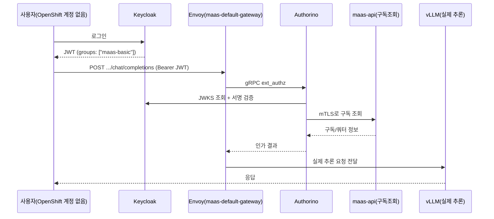

# 시나리오 17: MaaS 외부 OIDC 인증

**모듈:** 서빙 및 추론 > MaaS
**지원 단계:** GA (RHOAI 3.5)
**관련 컴포넌트:** MaaS Gateway, Authorino, Keycloak

## 목적

OpenShift 계정이 없는 외부 사용자/앱이 별도 IDP(Keycloak)에서 받은 OIDC 토큰만으로 MaaS API를 호출할
수 있는지 검증한다. IDP 쪽 그룹(`maas-basic`/`maas-premium`)이 MaaS 구독/쿼터에 그대로 반영되는지도
함께 확인한다.

**시사점**: 이게 되면 MaaS가 "OpenShift 클러스터 계정을 가진 사람만 쓰는 사내 도구"에서 "외부에
내어줄 수 있는 서비스"로 바뀐다. 조직 관리도 이원화 안 되고(IDP 그룹만 관리하면 MaaS 쿼터가 따라옴),
기존 사내 SSO를 그대로 재사용할 수 있다.

## 요청 흐름



`/v1/models`(카탈로그 조회)는 Authorino 인가 후 Envoy가 `maas-api`로 직접 응답하고, vLLM을 거치지
않는다 — 실제 추론이 필요한 경로(`/<ns>/<model>/v1/...`)만 vLLM까지 간다.

## 사전 조건

- 베이스 클러스터 + RHOAI 3.5 + MaaS 게이트웨이 (`openshift-aws-harness` → `monitoring-llmd-rhoai/harness maas`)
- 외부 IDP: **Red Hat build of Keycloak(RHBK) 오퍼레이터**로 클러스터 안에 직접 구축 (Bitnami나
  별도 VM이 아니라 OperatorHub 인증 오퍼레이터로 결정)

## 절차

```sh
cd openshift-ai-maas-demo/harness

./harness.sh scenario17-keycloak-up          # RHBK 오퍼레이터 + Keycloak 인스턴스
./harness.sh scenario17-keycloak-realm       # realm + 그룹 2개 + 유저 2명 + OIDC 클라이언트
./harness.sh scenario17-keycloak-token-test  # Keycloak 단독 검증 (토큰에 groups 클레임 확인)
./harness.sh scenario17-wire-authpolicy      # Authorino가 Keycloak을 신뢰하도록 연결
./harness.sh scenario17-authorino-trust-ca   # Authorino가 라우터 CA(Keycloak)+service-ca(maas-api mTLS) 신뢰하도록

# 모델 배포는 monitoring-llmd-rhoai에서 (예: LLMD_NAMESPACE=maas-demo LLMD_GATEWAY_NAME=maas-default-gateway)
MODEL_NAMESPACE=maas-demo MODEL_NAME=maas-demo-model \
  MODEL_GROUP_LIMITS="maas-basic:500,maas-premium:100000" \
  ./harness.sh scenario17-register-model     # MaaSSubscription + MaaSAuthPolicy 그룹별 등록

bash ./local/scenario17-manual-test.sh       # 검증 (노트북에서 SSH 없이 바로 실행)
```

## 실측 결과 (2026-09-23)

**`GET /v1/models`, 실제 채팅 완성 호출 모두 성공.** OpenShift 계정 없는 Keycloak 사용자가 인증
통과, 모델 카탈로그+구독 정보 응답(HTTP 200, 토큰 없으면 401), `POST .../v1/chat/completions`도
HTTP 200으로 실제 vLLM 응답을 받는다. `local/scenario17-manual-test.sh`로 재현 가능.

Authorino→`maas-api` mTLS 403 문제(아래 lessonlearn.md 참고)는 `./harness.sh
scenario17-authorino-trust-ca`로 해결/자동화됨.

과정에서 RHOAI 3.5 기본 설치 자체의 버그 4개를 찾았고 모두 harness 스크립트에 반영해서 다음
설치부터는 자동으로 해결된다(API 필드 개명, Gateway TLS 설정 누락, 두 컨트롤러의 AuthPolicy
소유권 충돌, Authorino→maas-api mTLS). 각 버그의 원인 분석·재현 로그·해결 과정 전체는
`lessonlearn.md` 참고(민감정보 없는 git 추적 파일이라 여기 반복 안 함).

## 남은 작업

- Group Mapping → 실제 쿼터 차등 적용(`maas-basic` 100 vs `maas-premium` 100000 토큰/시간) 검증
