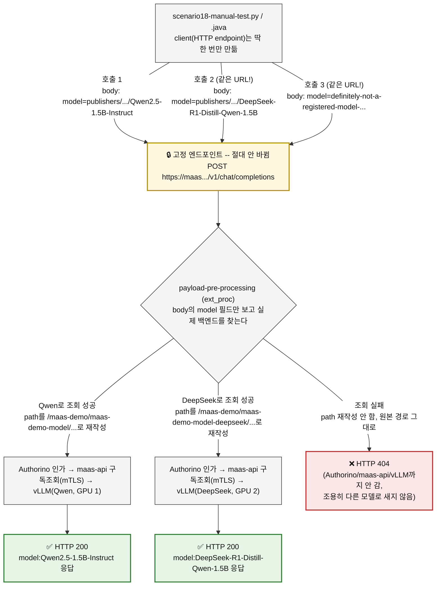

# 시나리오 18: OpenAI 호환 Body 기반 모델 라우팅

**모듈:** 서빙 및 추론 > MaaS
**지원 단계:** GA (RHOAI 3.5)
**관련 컴포넌트:** MaaS Gateway, 표준 OpenAI SDK

## 목적

지금까지(시나리오 13 등)는 모델마다 **URL 경로**가 달라서 모델을 바꾸려면 `base_url`도 매번
바꿔야 했다. 이 시나리오는 **URL은 고정**하고 요청 Body의 `model` 필드값만으로 MaaS Gateway가
실제 백엔드를 찾아 라우팅하는지, 그 결과에 따라 구독/쿼터(시나리오 17)도 모델별로 올바르게
갈리는지 검증한다. 되면 기존 OpenAI API 앱을 **엔드포인트 URL 한 줄만** 바꿔서 MaaS에 붙일 수
있다.

## 절차

### 0) 전/후 비교 — 왜 이게 "URL 안 바꿔도 된다"는 뜻인지 코드로 확인

**이전 (RHOAI 3.4까지, 경로 기반) — 모델을 바꾸려면 `base_url` 자체를 바꿔야 했다:**

```python
from openai import OpenAI

# 모델 A 호출 — base_url 안에 namespace/model 이름이 박혀 있음
client_a = OpenAI(
    base_url="https://maas.apps.myocp.sandbox1314.opentlc.com/llmd-scenario11/model-a",
    api_key="<MaaS API Key>",
)
resp_a = client_a.chat.completions.create(
    model="model-a",  # SDK가 요구하니 넣긴 하지만, 실제 라우팅은 base_url이 결정
    messages=[{"role": "user", "content": "ping from model A"}],
)

# 모델 B로 바꾸려면 client를 통째로 다시 만들어야 함 — base_url이 다르므로
client_b = OpenAI(
    base_url="https://maas.apps.myocp.sandbox1314.opentlc.com/llmd-scenario12/model-b",
    api_key="<MaaS API Key>",
)
resp_b = client_b.chat.completions.create(
    model="model-b",
    messages=[{"role": "user", "content": "ping from model B"}],
)
```

**이후 (RHOAI 3.5, Body 기반) — `client`는 한 번만 만들고, 이후로는 `model` 값만 바꾼다:**

```python
from openai import OpenAI

# client 하나 — base_url에 모델 정보가 전혀 없음, 이후 절대 안 바뀜
client = OpenAI(
    base_url="https://maas.apps.myocp.sandbox1314.opentlc.com/v1",
    api_key="<MaaS API Key>",
)

resp_a = client.chat.completions.create(
    model="model-a",  # 라우팅을 실제로 결정하는 건 이제 이 값
    messages=[{"role": "user", "content": "ping from model A"}],
)
resp_b = client.chat.completions.create(
    model="model-b",  # client 재생성 없이 모델만 교체
    messages=[{"role": "user", "content": "ping from model B"}],
)
```

**의미**: 모델 선택이 연결 설정(`base_url`)에서 요청 데이터(`model` 필드)로 옮겨가서, 클라이언트는
한 번 설정한 뒤 다시 안 건드리고 모델을 런타임 값으로 다룰 수 있다.

### 1) 실제 실행

```sh
pip install openai  # 이미 있으면 생략

python3 - <<'PY'
from openai import OpenAI

client = OpenAI(
    base_url="https://maas.apps.myocp.sandbox1314.opentlc.com/v1",  # 모델별 경로 없이 고정
    api_key="<MaaS API Key>",
)

# 모델 A 호출 — URL 그대로, model 필드만 바꿔서 전송
resp_a = client.chat.completions.create(
    model="<모델A 식별자>",
    messages=[{"role": "user", "content": "ping from model A"}],
)
print("A:", resp_a.choices[0].message.content)

# 모델 B 호출 — 코드상 base_url 변경 없음, model 필드만 교체
resp_b = client.chat.completions.create(
    model="<모델B 식별자>",
    messages=[{"role": "user", "content": "ping from model B"}],
)
print("B:", resp_b.choices[0].message.content)
PY
```

검증 포인트:
1. 위 두 호출이 `base_url`을 전혀 바꾸지 않고도 서로 다른 백엔드 모델에 도달하는지
   (응답 내용/모델 자체 정체성으로 구분, 또는 각 모델 pod 로그에서 요청 수신 확인)
2. `model` 필드에 **구독하지 않은/존재하지 않는** 모델명을 넣었을 때 명확한 에러(404 또는 인가 거부)로
   응답하는지 — 조용히 엉뚱한 모델로 라우팅되면 안 됨
3. 모델별로 서로 다른 쿼터/구독이 걸려 있다면(예: 모델A는 premium 전용), Body 기반 라우팅에서도 그
   정책이 그대로 적용되는지

## 예상 결과

- 클라이언트 코드는 `base_url` 한 번만 설정하고, 이후 모델 전환은 순수하게 요청 Body의 `model` 값만으로
  이루어진다.
- 존재하지 않거나 구독 안 된 모델명은 명확한 에러로 막힌다(자동으로 기본 모델로 폴백되거나 하지 않음).

## 테스트 스크립트 동작 흐름 (`harness/local/scenario18-manual-test.py` / `.java`)



**핵심은 URL이 아니라 body다**: 세 호출 모두 같은 URL, `base_url`은 안 바뀜.
`payload-pre-processing`이 body의 `model` 필드로 라우팅 결정 — 성공 시 200, 실패 시 404.

## 실측 결과 (2026-09-23)

`model` 필드는 `/v1/models` 응답의 `id` 값을 그대로 넣어야 라우팅된다(짧은 이름은 404):

```json
{"model": "publishers/maas-demo/models/Qwen2.5-1.5B-Instruct", "messages": [...]}
```

**실제 서로 다른 두 모델로 라우팅 확인 완료**: GPU 노드를 하나 더 추가해(quota 재확인 후
`myocp-z8mpx-gpu-g4dn-xlarge-us-east-1a` replicas=2) Qwen2.5-1.5B-Instruct와
DeepSeek-R1-Distill-Qwen-1.5B를 각자의 GPU에 띄우고, **완전히 같은 URL**에 `model` 필드만
바꿔서 호출 — 둘 다 HTTP 200, 응답 JSON의 `model` 필드도 요청한 모델과 정확히 일치. 경로
기반(시나리오 17) 엔드포인트도 여전히 동작하므로 둘은 동시 지원됨. `local/scenario18-manual-test.py`
/ `.java`가 이 두 모델로 검증하고 "요청한 model" vs "실제 응답한 모델"을 비교 출력한다.

CPU에서 두 번째 모델을 띄우려던 시도(공식 vLLM 커뮤니티 CPU 이미지, 실제 요청에서 무한
루프)는 포기하고 GPU로 전환 — 상세 재현 과정은 `lessonlearn.md` 참고.

**두 번째 모델 재현용 harness 명령** (GPU 하나 더 필요, 먼저 quota 확인):
```sh
GPU_REPLICAS=2 ./harness.sh scenario17-scale-gpu
MODEL_NAMESPACE=maas-demo MODEL_NAME=maas-demo-model-deepseek \
  MODEL_URI="hf://deepseek-ai/DeepSeek-R1-Distill-Qwen-1.5B" \
  ./harness.sh scenario18-deploy-model
```
