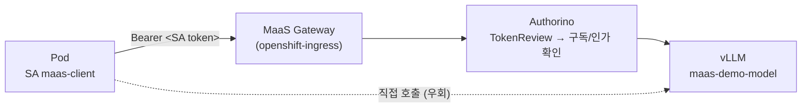

# 시나리오 21: 클러스터 내부 Pod의 MaaS Gateway 경유 모델 호출

**모듈:** 서빙 및 추론 > MaaS
**지원 단계:** GA (RHOAI 3.5)
**관련 컴포넌트:** MaaS Gateway, Authorino(kubernetesTokenReview), MaaSSubscription, MaaSAuthPolicy

## 목적

클러스터 내부 워크로드(Pod)가 MaaS의 client가 되는 구성을 검증한다. Pod는 별도의 API key 없이
**ServiceAccount token**을 자격 증명으로 사용하며, MaaS Gateway는 이를 `TokenReview`로 검증하여
`system:serviceaccount:<namespace>:<sa>` 주체로 식별한다. 이 주체를 `MaaSSubscription`/`MaaSAuthPolicy`에
명시하면 사람 사용자와 동일한 인가·쿼터 정책이 애플리케이션에도 적용된다.

## 구성

| 리소스 | 이름 | 비고 |
|---|---|---|
| Namespace | `maas-pod-client` | client 워크로드 |
| ServiceAccount | `maas-client` | 구독 보유 |
| ServiceAccount | `maas-client-nosub` | 구독 없음 (대조군) |
| MaaSSubscription | `models-as-a-service/maas-pod-client-sub` | `owner.users: [system:serviceaccount:maas-pod-client:maas-client]`, 1000 tok/h |
| MaaSAuthPolicy | `models-as-a-service/maas-pod-client-access` | 동일 주체, `maas-demo/maas-demo-model` |
| Job | `maas-client-test-<sa>` | `ubi9/ubi-minimal` + curl, SA token으로 호출 |

```yaml
apiVersion: maas.opendatahub.io/v1alpha1
kind: MaaSSubscription
metadata: {name: maas-pod-client-sub, namespace: models-as-a-service}
spec:
  owner:
    users: ["system:serviceaccount:maas-pod-client:maas-client"]
  modelRefs:
  - name: maas-demo-model
    namespace: maas-demo
    tokenRateLimits: [{limit: 1000, window: 1h}]
```

## 호출 경로



| 경로 | Pod 측 접속 대상 |
|---|---|
| internal | `maas-default-gateway-maas-gateway-class.openshift-ingress.svc:443` (Host/SNI는 `maas.apps.<domain>` 유지) |
| external | `maas.apps.<domain>` (AWS ELB 경유) |

## 절차

Pod 내부에서 수행하는 호출:

```sh
TOKEN=$(cat /var/run/secrets/kubernetes.io/serviceaccount/token)
curl -sk https://maas.apps.<domain>/v1/chat/completions \
  -H "Authorization: Bearer $TOKEN" -H 'Content-Type: application/json' \
  -d '{"model":"publishers/maas-demo/models/Qwen2.5-1.5B-Instruct","messages":[{"role":"user","content":"Say hello in one word."}]}'
```

자동화 (리소스 생성 → SA별 Job 실행 → HTTP 코드 판정):

```sh
./harness.sh scenario21-pod-client                       # internal 경로
MAAS_PATH_MODE=external ./harness.sh scenario21-pod-client
oc logs job/maas-client-test-maas-client -n maas-pod-client
```

수동 확인 (client Pod 기동 → `oc exec`로 호출 → Pod 삭제):

| 환경 | 명령 |
|---|---|
| bash | `PROMPT='쿠버네티스를 한 문장으로 설명해줘' harness/local/scenario21-manual-test.sh` |
| PowerShell | `.\harness\local\scenario21-manual-test.ps1 -Prompt '쿠버네티스를 한 문장으로 설명해줘'` |

## ServiceAccount token의 구조

ServiceAccount token은 kube-apiserver가 RS256으로 서명한 JWT이다. 형식은 OIDC ID token과 같지만, MaaS Gateway는 이를 OIDC 방식(JWKS 서명 검증)이 아닌 `TokenReview` API 호출로 검증한다.

```json
{"iss":"https://kubernetes.default.svc","aud":["https://kubernetes.default.svc"],
 "sub":"system:serviceaccount:maas-pod-client:maas-client",
 "kubernetes.io":{"namespace":"maas-pod-client","serviceaccount":{"name":"maas-client"}}}
```

| 구분 | ServiceAccount token (시나리오 21) | Keycloak OIDC JWT (시나리오 17) |
|---|---|---|
| 발급자 (`iss`) | kube-apiserver | Keycloak realm |
| 주체 | `system:serviceaccount:<ns>:<sa>` | `preferred_username` / `sub` |
| 그룹 | `system:serviceaccounts`, `system:serviceaccounts:<ns>` (TokenReview 결과) | token의 `groups` claim |
| Gateway 검증 | `kubernetesTokenReview` (identity `openshift-identities`) | `jwt` (issuer discovery + JWKS) |
| 폐기 | SA 삭제 시 즉시 무효 (TokenReview가 SA 존재 확인) | 만료 시까지 유효 |
| 발급 | kubelet이 projected volume으로 자동 발급·교체 | client가 token endpoint 호출 |

## 실측 결과 (2026-10-07, sandbox49)

| 케이스 | 주체 | 기대 | internal | external |
|---|---|---|---|---|
| `GET /v1/models` | `maas-client` | 200 | 200 | 200 |
| `POST /v1/chat/completions` (body 라우팅) | `maas-client` | 200 | 200 | 200 |
| `POST /maas-demo/maas-demo-model/v1/chat/completions` (경로 라우팅) | `maas-client` | 200 | 200 | 200 |
| token 없음 | — | 401 | 401 | 401 |
| `POST /v1/chat/completions` | `maas-client-nosub` | 403 | 403 | 403 |
| `POST .../v1/chat/completions` (경로) | `maas-client-nosub` | 403 | 403 | 403 |
| vLLM Service 직접 호출 (`:8000/v1/models`) | 무관 | — | **200** | **200** |

- 구독 보유 SA는 body·경로 라우팅 모두 정상 응답(`"content":"Hello."`)을 받았다.
- 구독 없는 SA는 `/v1/models`에서 빈 목록을, 추론 요청에서 `403 no matching subscription found for user`를 받았다.
- internal·external 경로의 결과가 동일하다. 내부 워크로드는 ELB를 거치지 않고 gateway Service로 직접 접속해도 동일한 정책을 적용받는다.

### 수동 테스트 출력 (PowerShell)

#### internal 경로 (한국어 프롬프트)

```text
PS C:\Users\USER\workspace\openshift-ai-maas-demo> .\harness\local\scenario21-manual-test.ps1 -Prompt '쿠버네티스를 한 문장으로 설명해줘'

== 0) client Pod 기동 (maas-pod-client : SA maas-client, maas-client-nosub) ==
경로: internal | host: maas.apps.myocp.sandbox49.opentlc.com | model: publishers/maas-demo/models/Qwen2.5-1.5B-Instruct

== 1) [maas-client] GET /v1/models -- HTTP 200, 모델 1개 기대 ==
```

```json
{
  "data": [
    {
      "id": "publishers/maas-demo/models/Qwen2.5-1.5B-Instruct",
      "created": 1791261802,
      "object": "model",
      "owned_by": "maas-demo/maas-demo-model",
      "kind": "LLMInferenceService",
      "url": "https://maas.apps.myocp.sandbox49.opentlc.com/",
      "ready": true,
      "subscriptions": [
        {
          "name": "maas-pod-client-sub"
        }
      ]
    }
  ],
  "object": "list"
}
```

```text
HTTP 200

== 2) [maas-client] POST /v1/chat/completions -- HTTP 200 기대 ==
질문: 쿠버네티스를 한 문장으로 설명해줘
```

```json
{
  "id": "chatcmpl-16158e7c-fe5b-4095-98e6-e346869dbdd0",
  "object": "chat.completion",
  "created": 1791319091,
  "model": "Qwen2.5-1.5B-Instruct",
  "choices": [
    {
      "index": 0,
      "message": {
        "role": "assistant",
        "content": "쿠버네티스는 Kubernetes의 약자로,개발자가 쉽게 사용할 수 있는 클라우드 컴퓨팅 자원 관리 플랫폼입니다.",
        "refusal": null,
        "annotations": null,
        "audio": null,
        "function_call": null,
        "reasoning": null
      },
      "logprobs": null,
      "finish_reason": "stop",
      "stop_reason": null,
      "token_ids": null,
      "routed_experts": null
    }
  ],
  "service_tier": null,
  "system_fingerprint": "vllm-0.24.0+rhaiv.13-39e1d603",
  "usage": {
    "prompt_tokens": 44,
    "total_tokens": 84,
    "completion_tokens": 40,
    "prompt_tokens_details": null
  },
  "prompt_logprobs": null,
  "prompt_token_ids": null,
  "prompt_text": null,
  "kv_transfer_params": null
}
```

```text
HTTP 200

== 3) [maas-client-nosub] POST /v1/chat/completions -- HTTP 403 기대 (구독 없음) ==
no matching subscription found for user
HTTP 403

== 4) [maas-client-nosub] vLLM Service 직접 호출 (Gateway 우회) -- NetworkPolicy 없으면 200 ==
```

```json
{
  "id": "chatcmpl-9c6f1e9d8c562b28",
  "object": "chat.completion",
  "created": 1791319096,
  "model": "Qwen2.5-1.5B-Instruct",
  "choices": [
    {
      "index": 0,
      "message": {
        "role": "assistant",
        "content": "Kubernetes (kube)는 오픈소스로 제공되는 Kubernetes 운영 체제입니다. 이는 자바스크립트와 Go 언어를 사용하여 개발된 시스템으로, 여러 개의 웹 서비스를 동일한 환경에서 실행하고 관리할 수 있도록",
        "refusal": null,
        "annotations": null,
        "audio": null,
        "function_call": null,
        "reasoning": null
      },
      "logprobs": null,
      "finish_reason": "length",
      "stop_reason": null,
      "token_ids": null,
      "routed_experts": null
    }
  ],
  "service_tier": null,
  "system_fingerprint": "vllm-0.24.0+rhaiv.13-39e1d603",
  "usage": {
    "prompt_tokens": 44,
    "total_tokens": 108,
    "completion_tokens": 64,
    "prompt_tokens_details": null
  },
  "prompt_logprobs": null,
  "prompt_token_ids": null,
  "prompt_text": null,
  "kv_transfer_params": null
}
```

```text
HTTP 200
```

#### external 경로 (ELB 경유)

```text
PS C:\Users\USER\workspace\openshift-ai-maas-demo> .\harness\local\scenario21-manual-test.ps1 -PathMode external

== 0) client Pod 기동 (maas-pod-client : SA maas-client, maas-client-nosub) ==
경로: external | host: maas.apps.myocp.sandbox49.opentlc.com | model: publishers/maas-demo/models/Qwen2.5-1.5B-Instruct

== 1) [maas-client] GET /v1/models -- HTTP 200, 모델 1개 기대 ==
```

```json
{
  "data": [
    {
      "id": "publishers/maas-demo/models/Qwen2.5-1.5B-Instruct",
      "created": 1791261802,
      "object": "model",
      "owned_by": "maas-demo/maas-demo-model",
      "kind": "LLMInferenceService",
      "url": "https://maas.apps.myocp.sandbox49.opentlc.com/",
      "ready": true,
      "subscriptions": [
        {
          "name": "maas-pod-client-sub"
        }
      ]
    }
  ],
  "object": "list"
}
```

```text
HTTP 200

== 2) [maas-client] POST /v1/chat/completions -- HTTP 200 기대 ==
질문: Say hello in one word.
```

```json
{
  "id": "chatcmpl-0c936613-6198-42fc-ad86-fe7dc8c3088a",
  "object": "chat.completion",
  "created": 1791319138,
  "model": "Qwen2.5-1.5B-Instruct",
  "choices": [
    {
      "index": 0,
      "message": {
        "role": "assistant",
        "content": "Hello.",
        "refusal": null,
        "annotations": null,
        "audio": null,
        "function_call": null,
        "reasoning": null
      },
      "logprobs": null,
      "finish_reason": "stop",
      "stop_reason": null,
      "token_ids": null,
      "routed_experts": null
    }
  ],
  "service_tier": null,
  "system_fingerprint": "vllm-0.24.0+rhaiv.13-39e1d603",
  "usage": {
    "prompt_tokens": 35,
    "total_tokens": 38,
    "completion_tokens": 3,
    "prompt_tokens_details": null
  },
  "prompt_logprobs": null,
  "prompt_token_ids": null,
  "prompt_text": null,
  "kv_transfer_params": null
}
```

```text
HTTP 200

== 3) [maas-client-nosub] POST /v1/chat/completions -- HTTP 403 기대 (구독 없음) ==
no matching subscription found for user
HTTP 403

== 4) [maas-client-nosub] vLLM Service 직접 호출 (Gateway 우회) -- NetworkPolicy 없으면 200 ==
```

```json
{
  "id": "chatcmpl-836ca321fb19e194",
  "object": "chat.completion",
  "created": 1791319142,
  "model": "Qwen2.5-1.5B-Instruct",
  "choices": [
    {
      "index": 0,
      "message": {
        "role": "assistant",
        "content": "Hello.",
        "refusal": null,
        "annotations": null,
        "audio": null,
        "function_call": null,
        "reasoning": null
      },
      "logprobs": null,
      "finish_reason": "stop",
      "stop_reason": null,
      "token_ids": null,
      "routed_experts": null
    }
  ],
  "service_tier": null,
  "system_fingerprint": "vllm-0.24.0+rhaiv.13-39e1d603",
  "usage": {
    "prompt_tokens": 35,
    "total_tokens": 38,
    "completion_tokens": 3,
    "prompt_tokens_details": null
  },
  "prompt_logprobs": null,
  "prompt_token_ids": null,
  "prompt_text": null,
  "kv_transfer_params": null
}
```

```text
HTTP 200
```
| 관찰 | 내용 |
|---|---|
| 한국어 프롬프트 | PowerShell → Pod → Gateway → vLLM 전 구간에서 손상 없이 전달·응답 |
| 4) 우회 호출 | 구독 없는 SA(`maas-client-nosub`)도 vLLM 직접 호출로 응답을 받는다. 3)의 403과 대비되는 인가 우회 |

## 시사점

- **애플리케이션 단위 거버넌스:** API key 발급·보관 없이 ServiceAccount 자체가 MaaS 주체가 된다. token은 kubelet이 자동으로 교체하므로 key를 따로 순환할 필요가 없다.
- **우회 경로 존재:** `maas-demo-model-kserve-workload-svc:8000`은 인증 없이 응답한다. 클러스터 내부 Pod는 Gateway의 인가·쿼터를 거치지 않고 vLLM에 직접 접근할 수 있으므로, 운영 환경에서는 모델 namespace에 Gateway(`openshift-ingress`)발 트래픽만 허용하는 `NetworkPolicy`가 필요하다.

```sh
oc get svc maas-demo-model-kserve-workload-svc -n maas-demo
oc get networkpolicy -n maas-demo          # 현재 없음
```
