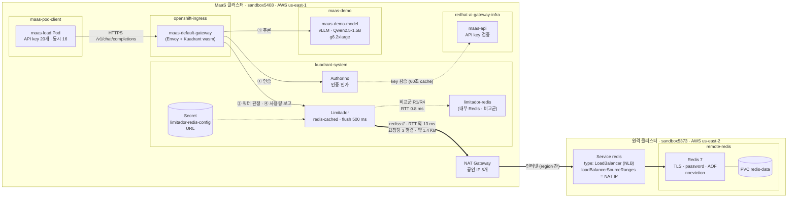
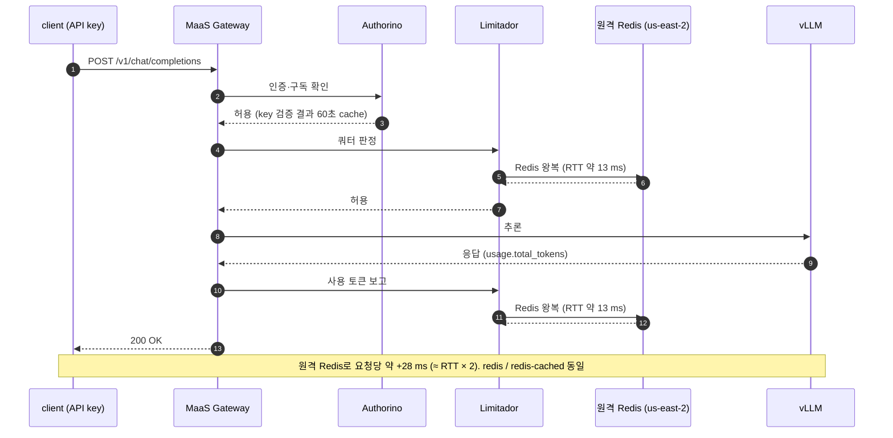

# 시나리오 31: 원격 region Redis 환경에서의 MaaS 부하 특성

**모듈:** 서빙 및 추론 > MaaS
**지원 단계:** GA (RHOAI 3.5, RHCL 1.4)
**관련 컴포넌트:** Limitador(`spec.storage`), External Redis, TokenRateLimitPolicy
**후속:** 장애 상황은 [시나리오 32](32-maas-remote-redis-failure.md)에서 다룬다

## 목적

Limitador 저장소인 Redis를 다른 region에 두고 MaaS에 부하를 가했을 때 다음을 측정하여, 원격 Redis 구성의 타당성과 회선 요구 사항을 실측으로 제시한다.

| 측정 항목 | 의미 |
|---|---|
| client 응답 시간 (p50/p95/p99) | Redis 위치가 사용자 체감 지연에 주는 영향 |
| Limitador → Redis 명령 수, 요청당 명령 수 | Redis 부하 산정 근거 |
| Limitador → Redis 네트워크 사용량, 요청당 byte | 회선 대역폭(1/10 Gbps) 요구 산정 근거 |
| Redis key 수, 메모리 | Redis 용량 산정 근거 |
| 부하 중 RTT | 부하가 회선 지연을 증가시키는지 여부 |

## 구성

### 구성도



### 요청 처리 흐름 (실측 기반)



| 구분 | 경로 | 요청이 대기하는가 |
|---|---|---|
| 인증 | Gateway → Authorino → maas-api | 예 (클러스터 내부, cache 60초) |
| 쿼터 판정·사용량 보고 | Gateway → Limitador → Redis | **예** (요청당 Redis 왕복 약 2회, 실측 +28 ms) |

설계상 `redis-cached`는 Limitador 메모리로 판정하고 Redis에는 비동기 반영하도록 되어 있으나,
본 구성(TokenRateLimitPolicy, RHCL 1.4)에서는 `redis`와 응답 시간·Redis 명령 수가 동일하게 측정되었다(실측 결과 6. 저장소 방식·위치 비교).

| 구분 | 리소스 | 설정 |
|---|---|---|
| 원격 Redis | `remote-redis/redis` (sandbox5373) | `rhel9/redis-7`, TLS, 비밀번호, AOF + PVC, `noeviction` |
| 노출 | `remote-redis/redis` Service | `type: LoadBalancer`(NLB), `loadBalancerSourceRanges` = MaaS 클러스터 NAT IP |
| 내부 Redis(비교군) | `kuadrant-system/limitador-redis` | 단일 Pod, PVC 없음 |
| Limitador | `kuadrant-system/limitador` | `redis-cached`(flush 500 ms) 또는 `redis` |
| 연결 정보 | `kuadrant-system/limitador-redis-config` | key `URL` = `rediss://default:<pw>@<NLB>:6379#insecure` |
| 모델 | `maas-demo/maas-demo-model` | `Qwen2.5-1.5B-Instruct`, `g6.2xlarge` |
| 부하 주체 | `maas-pod-client/maas-load-01`~`20` | 구독 `maas-load-sub`(한도 1억 tok/1h, 차단 없음) |

```sh
oc get limitador limitador -n kuadrant-system -o jsonpath='{.spec.storage}'
oc get secret limitador-redis-config -n kuadrant-system -o jsonpath='{.data.URL}' | base64 -d
oc get svc redis -n remote-redis -o wide          # 원격 클러스터
```

## 시험 조건

| 회차 | Redis 위치 | Limitador 저장소 방식 | 목적 |
|---|---|---|---|
| R1 | 클러스터 내부 | `redis-cached` | 기준값 |
| R2 | 원격 region | `redis-cached` | **권장 구성** |
| R3 | 원격 region | `redis` | 대조군: 매 요청 Redis 동기 대기 |
| R4 | 클러스터 내부 | `redis` | 대조군 기준값 |

공통 부하: 주체 20개, 동시 요청 16, 180초, `max_tokens: 16`.

## 절차

1. 원격 클러스터에 Redis를 배포한다.
2. MaaS 클러스터에서 원격 Redis 연결과 RTT를 확인한 뒤 Limitador 연결을 전환한다.
3. 회차별로 저장소 방식과 Redis 위치를 바꾸며 부하를 가한다.
4. 부하 전후 Redis `INFO`(commandstats, net bytes, memory)와 Limitador metric 차이를 산출한다.
   측정용 명령(PING, INFO, AUTH 등)은 Limitador 사용량에서 제외한다.

## 판정 기준

| 항목 | 기준 |
|---|---|
| 응답 시간 | R2의 p95가 R1 대비 측정 오차 수준 이내 |
| 오류 | R1~R4 모두 HTTP 200 100% |
| 대역폭 | Limitador → Redis 트래픽이 1 Gbps의 1% 미만 |
| RTT | 부하 중 RTT가 유휴 RTT와 같은 수준 |

## 자동화

```sh
# 원격 클러스터 (oc login 원격)
ALLOWED_CIDRS=<NAT IP>/32,... bash harness/remote/scenario31-remote-redis-up.sh

# MaaS 클러스터 (oc login MaaS)
REDIS_ACTION=probe bash harness/remote/scenario31-limitador-redis-switch.sh          # 현재 저장소 PING/RTT
bash harness/remote/scenario31-limitador-redis-switch.sh                             # 원격 Redis로 전환
REDIS_ACTION=mode REDIS_MODE=redis bash harness/remote/scenario31-limitador-redis-switch.sh
REDIS_ACTION=restore bash harness/remote/scenario31-limitador-redis-switch.sh        # 내부 Redis로 복원
LOAD_LABEL=R2 SUBJECTS=20 CONCURRENCY=16 DURATION=180 bash harness/remote/scenario31-remote-redis-load.sh

# 정리 (원격 클러스터)
REDIS_ACTION=down bash harness/remote/scenario31-remote-redis-up.sh
```

## 사전 확인 결과 (2026-10-09, sandbox5408 → sandbox5373)

| 항목 | 결과 |
|---|---|
| RTT (내부 Redis) | 평균 0.77 ms |
| RTT (원격 Redis, us-east-1 → us-east-2) | 평균 13.5 ms (최소 13, 최대 14) |
| 시나리오 22 (쿼터 집행) on 원격 Redis | ALL PASS |
| URL 형식 | `rediss://:<pw>@` (빈 사용자명)은 인증 실패. `rediss://default:<pw>@` 필요 |
| 인증서 | NLB hostname이 64자를 넘어 CN 불가 → SAN에만 기재 |
| Limitador metric | `datastore_latency` 미노출, `batcher_flush_size`는 값 0으로 사용 불가. RTT는 `redis-cli --latency`로 측정 |

## 실측 결과 (2026-10-09, sandbox5408 us-east-1 → sandbox5373 us-east-2)

### 1. 연결 및 RTT

| 경로 | RTT 평균 (최소/최대) |
|---|---|
| Limitador namespace → 내부 Redis | 0.77 ms (0 / 3) |
| Limitador namespace → 원격 Redis (us-east-2) | 11.5–14.1 ms (11 / 17) |
| 원격 Redis, 부하 중 (56.8 req/s) | 12.2 ms (최대 15) — 유휴 시와 동일 |

### 2. 쿼터 집행 (시나리오 22, 원격 Redis + `redis-cached`)

```text
PASS  한도 내 요청 성공 (마지막 성공 시 누적 204 tok) -> 200
PASS  한도 초과 시 차단 (#3) -> 429
PASS  차단 직후 재요청 -> 429
PASS  다른 주체 (한도 독립) -> 200
PASS  시간 창 경과 후 복구 -> 200
RESULT: ALL PASS
```

원격 Redis에서도 한도 집행, 주체별 카운터 분리, 시간 창 복구가 내부 Redis와 동일하게 동작하였다.

### 3. 예비 부하 (원격 Redis + `redis-cached`, API key 20개, 동시 16, 40초)

```text
requests (200 / total)               2270 / 2271
HTTP codes                           200:2270 500:1
throughput (req/s)                   56.8
client latency p50/p95/p99/max ms    267 / 302 / 457 / 537
Limitador authorized/limited calls   2270 / 0
Redis commands from Limitador        6810 (121.6/s, 3.00 per request)
  command mix                        get=2270 incrby=2270 evalsha=2270
Redis network from Limitador (approx) in 54.7 KB/s, out 0.6 KB/s = 0.453 Mbps (1395 B/request)
Redis keys                           25 -> 25
Redis used_memory                    1.23 MB (peak 1.25 MB)
RTT under load, avg of samples (ms)  12.17 (max 15)
```

| 관찰 | 내용 |
|---|---|
| Redis 명령 | 요청 1건당 정확히 3개(`EVALSHA`, `INCRBY`, `GET`). `redis-cached`이지만 요청 단위로 Redis에 반영되며, Redis 부하는 카운터 수가 아니라 **요청률에 비례**한다 |
| 네트워크 | 요청당 약 1.4 KB, 대부분 Limitador → Redis 방향(카운터 key가 limit 정의 JSON을 포함하여 길다) |
| 메모리 | 카운터 25개에 1.23 MB. 카운터 수(구독 × 주체 × 모델)에 비례하며 요청률과 무관 |

### 4. 요청률별 회선 사용량 환산 (요청당 1.4 KB, 3 명령 기준)

| MaaS 요청률 | Redis 명령/s | 회선 사용량 | 1 Gbps 대비 | 10 Gbps 대비 |
|---|---|---|---|---|
| 57 req/s (실측) | 171 | 0.45 Mbps | 0.05% | 0.005% |
| 1,000 req/s | 3,000 | 약 11 Mbps | 1.1% | 0.11% |
| 10,000 req/s | 30,000 | 약 112 Mbps | 11% | 1.1% |

1,000 req/s 이상은 실측값의 선형 환산이다. 단일 GPU 모델 기준 실측 최대는 57 req/s였다.

### 5. 부가 발견: ServiceAccount token client의 인증 병목

ServiceAccount token으로 부하(동시 16)를 가하자 31,896건 중 401이 28,256건, 500이 3,240건 발생하였다.
Authorino가 SA token을 요청마다 `kubernetesTokenReview`로 검증하며 이 단계에는 cache가 없어,
kube-apiserver 호출이 시간 초과(`context canceled`)로 실패한 것이다. Redis와는 무관하다.

| client 자격 증명 | 인증 검증 | 부하 시 |
|---|---|---|
| ServiceAccount token | 매 요청 TokenReview (cache 없음) | 대량 401 |
| MaaS API key (`sk-oai-`) | maas-api 검증 결과 60초 cache | 정상 (2,270/2,271) |

```sh
oc logs -n kuadrant-system deploy/authorino | grep UNAUTHENTICATED | wc -l
oc get authpolicy maas-gateway-auth -n openshift-ingress -o yaml   # openshift-identities: kubernetesTokenReview, cache 없음
```

고부하 client는 API key를 사용해야 한다.

### 6. 저장소 방식·위치 비교 (R1~R4, 주체 20, 동시 16, 180초)

원본 로그: `harness/results/scenario31/2026-10-09-r1-r4-comparison.log`

| 회차 | Redis | 방식 | 성공률 | 처리량 req/s | p50 / p95 / p99 ms | 명령/요청 | Mbps | 부하 중 RTT ms |
|---|---|---|---|---|---|---|---|---|
| R1 | 내부 | `redis-cached` | 99.62% (500: 44) | 64.9 | 236 / 253 / 279 | 2.99 | 0.697 | 0.81 (max 4) |
| R2 | 원격 | `redis-cached` | 99.66% (500: 36) | 58.7 | 264 / 284 / 302 | 2.99 | 0.614 | 12.84 (max 17) |
| R3 | 원격 | `redis` | 99.76% (500: 25) | 58.7 | 263 / 282 / 296 | 2.99 | 0.628 | 12.70 (max 19) |
| R4 | 내부 | `redis` | 99.82% (500: 21) | 64.8 | 236 / 253 / 282 | 2.99 | 0.690 | 0.88 (max 4) |

| 비교 | p50 차이 | p95 차이 | 처리량 차이 |
|---|---|---|---|
| 원격 − 내부 (`redis-cached`, R2 − R1) | +28 ms | +31 ms | −9.6% |
| 원격 − 내부 (`redis`, R3 − R4) | +27 ms | +29 ms | −9.4% |
| `redis` − `redis-cached` (원격, R3 − R2) | −1 ms | −2 ms | 0% |

| 관찰 | 내용 |
|---|---|
| 원격 Redis의 지연 영향 | 요청당 약 **+28 ms(≈ RTT 13 ms × 2)**. 저장소 방식과 무관하게 동일하다 |
| `redis-cached` 효과 | 관찰되지 않음. 두 방식 모두 요청당 Redis 명령 3개, 응답 시간 동일. 즉 본 구성(TokenRateLimitPolicy)에서는 요청 처리 중 Redis 왕복 2회가 동기적으로 발생한다 |
| 처리량 감소 원인 | 동시성 고정(16) 부하이므로 응답 시간 증가분(약 11%)만큼 처리량이 감소한 것이며, Redis 포화가 아니다 |
| Redis 자원 | 명령 약 185/s, 0.6–0.7 Mbps, 메모리 1.2 MB. 위치·방식과 무관하게 동일 |
| 500 오류 | 전 회차 0.2–0.4%로 Redis 위치·방식과 무관하게 발생. 원인 별도 확인 필요 |

**결론:** 원격 Redis는 요청당 약 2 × RTT의 지연을 추가한다. RTT 13 ms 환경에서 +28 ms이며, 본 시험의 짧은 요청(`max_tokens: 16`, 약 240 ms) 대비 약 12%, 수 초 단위인 일반 LLM 응답 대비 1% 내외이다. 대역폭 사용은 1 Gbps 대비 0.07% 수준이다.
