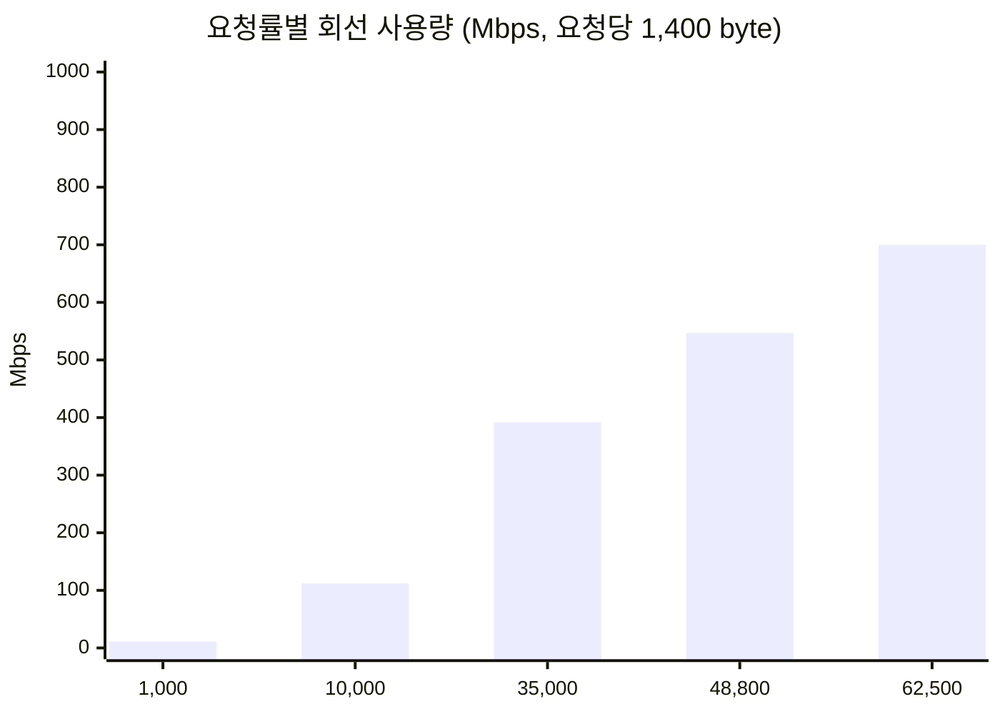

# 결론 1: 회선 수용 요청량 산정식

[시나리오 31-B](../31b-maas-remote-redis-high-load.md) 6장 결론 1의 근거를 기술한다.

## 결론

데이터센터 간 회선이 수용하는 MaaS 요청량은 다음 식으로 산정한다.

```text
최대 요청량 (req/s) = 회선 대역폭 (bit/s) × 사용률 ÷ (요청당 Redis 트래픽 (byte) × 8)
```

본 환경의 요청당 Redis 트래픽은 약 1,400 byte이다.

## 근거

### 1) 요청당 Redis 트래픽은 일정하다

| 측정 | 부하 | 요청당 Redis 트래픽 |
|---|---|---|
| 시나리오 31 R2 | 57 req/s | 1,395 byte |
| 시나리오 31 R1–R4, 시험 A | 57–246 req/s | 1,388–1,397 byte |

요청률이 약 4배 변해도 요청당 트래픽은 ±0.5% 이내로 일정하였다. 따라서 회선 사용량은 요청률에 비례한다.

### 2) 요청당 Redis 명령 수는 일정하다

| 측정 | 성공 요청 | `EVALSHA` | `INCRBY` | `GET` | 명령/요청 |
|---|---|---|---|---|---|
| 시나리오 31 R2 (원격) | 10,537 | 10,537 | 10,537 | 10,537 | 3.00 |
| 시나리오 31 R1 (내부) | 11,643 | 11,643 | 11,643 | 11,643 | 3.00 |
| 시험 A (원격, 211 req/s) | 32,565 | — | — | — | 3.00 |

### 3) 토큰 수와 무관하다

토큰 수는 `INCRBY`의 증가값(정수 1개)으로만 전달된다. 응답 토큰이 많아도 명령 수(3개)와 트래픽(약 1,400 byte)은 변하지 않는다.



요청률에 비례하며, 1 Gbps 회선의 70%(700 Mbps)는 약 62,500 req/s에 해당한다.

### 4) 사용률 70%

회선 포화 직전에는 대기열로 지연이 급증하므로 30%의 여유를 둔다.

## 고객 환경 적용

요청당 Redis 트래픽은 구독의 한도 구성에 따라 달라지므로 측정하여 대입한다([결론 6](06-premise.md)).

```sh
oc exec -n <redis-namespace> deploy/redis -- redis-cli INFO stats | grep total_net_   # 부하 전후 byte 차이
oc exec -n <redis-namespace> deploy/redis -- redis-cli INFO commandstats            # 부하 전후 calls 차이
```

```text
요청당 Redis 트래픽 = (total_net_input_bytes + total_net_output_bytes) 증가분 ÷ 처리한 MaaS 요청 수
```

원본: `harness/results/scenario31/2026-10-09-r1-r4-comparison.log`, `harness/results/scenario31b/2026-10-09-controls-c32.log`
