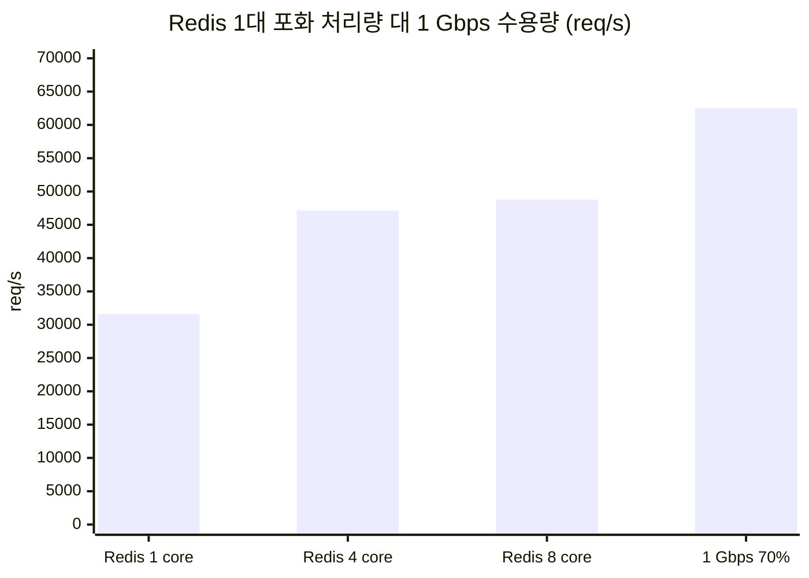

# 결론 2: 1 Gbps 회선의 충분성

[시나리오 31-B](../31b-maas-remote-redis-high-load.md) 6장 결론 2의 근거를 기술한다.

## 결론

Redis 1대 구성에서는 1 Gbps 회선으로 충분하다. 1 Gbps는 권장 운영(사용률 70%) 기준 약 62,500 req/s(83.4 MB/s)를 수용하며, Redis 1대의 상한(약 48,800 req/s, 65.1 MB/s)보다 크다. Redis Cluster 등으로 62,500 req/s를 넘기면 1 Gbps가 병목이 된다.

## 근거

### 1) 1 Gbps 수용량 ([결론 1](01-capacity-formula.md) 식 적용)

| 회선 | 사용률 | 계산 | 수용 요청량 |
|---|---|---|---|
| 1 Gbps | 100% | 10⁹ ÷ (1,400 × 8) | 약 89,000 req/s (118.8 MB/s) |
| 1 Gbps | 70% | 0.7 × 10⁹ ÷ (1,400 × 8) | **약 62,500 req/s (83.4 MB/s)** |

### 2) Redis 1대의 상한은 1 Gbps 수용량보다 작다 (시험 B)

| Redis 사양 | 포화 처리량 | Limitador 기준 회선 사용량 | 1 Gbps 대비 |
|---|---|---|---|
| CPU limit 1 core | 31,610 req/s | 354 Mbps | 35% |
| CPU limit 4 core | 47,154 req/s | 528 Mbps | 53% |
| CPU limit 8 core | **48,771 req/s** | **546 Mbps** | **55%** |



- 8 core에서 CPU throttling은 0%이고 main thread가 0.95 core로 포화되었다. Redis는 명령을 단일 thread에서 실행하므로 CPU를 늘려도 이 상한은 거의 변하지 않는다(4 → 8 core에서 +3%).
- 회선 사용량은 req/s × 1,400 byte × 8로 환산하였다. 벤치마크 실측값(8 core 1,600 연결 1,201 Mbps)은 명령마다 1.3 KB key를 보내 실제보다 약 2.2배 크다.

### 3) MaaS 실경로는 더 먼저 포화된다

MaaS 실경로는 인증 단계에서 약 285 req/s(회선 약 3 Mbps)에 포화되었다([발견 사항](../31b-maas-remote-redis-latency-lessonlearn.md) 1장).

## 적용 조건

| Redis 구성 | 상한 | 1 Gbps 판정 |
|---|---|---|
| Redis 1대 (Sentinel 포함) | 약 48,800 req/s | 충분 |
| Redis Cluster (shard N개) | 약 48,800 × N req/s (예상) | 62,500 req/s 초과 시 10 Gbps 필요 |

Redis Cluster의 처리량은 측정하지 않았으며, shard 수에 비례한다고 가정한 예상값이다.

## 한계

본 시험 경로의 실제 대역폭은 6.9–8.5 Gbps였다(시험 C). 1 Gbps로 제한된 회선에서 직접 측정하지 않았으며, 판정은 산정식에 의한 것이다.

```sh
oc exec -n <redis-namespace> deploy/redis -- redis-cli INFO stats | grep instantaneous_   # 현재 송수신 kbps
```

원본: `harness/results/scenario31b/20261009-090331-redis-bench.log`(1 core), `20261009-192848-redis-bench-cpu4.log`, `20261009-202227-redis-bench-cpu8.log`
