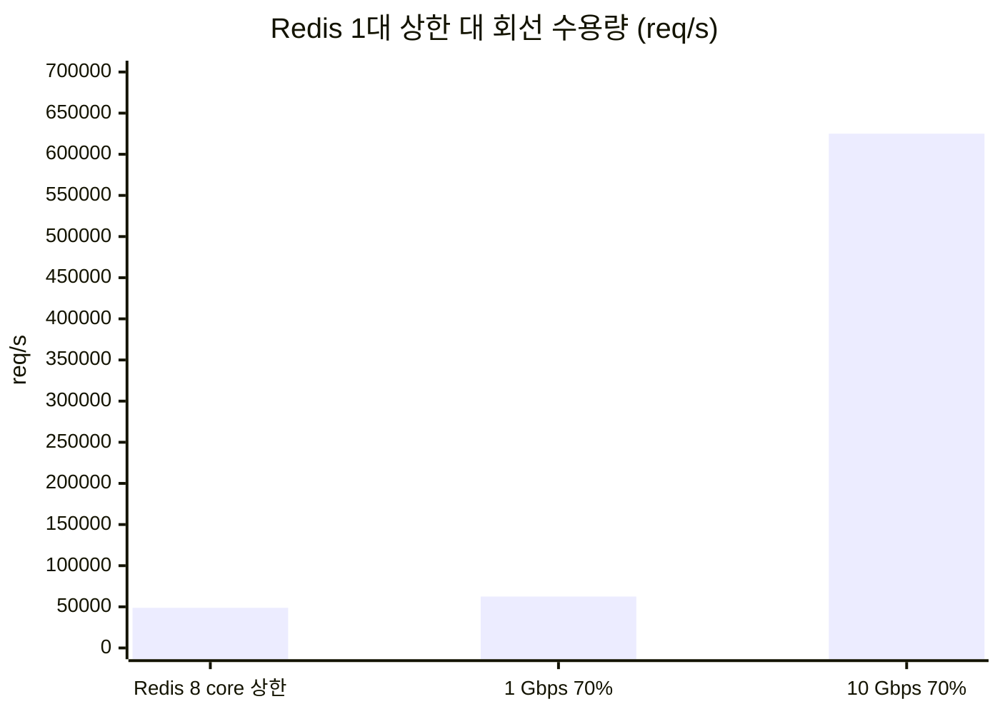

# 결론 3: 10 Gbps 회선과 병목

[시나리오 31-B](../31b-maas-remote-redis-high-load.md) 6장 결론 3의 근거를 기술한다.

## 결론

10 Gbps 회선은 권장 운영(70%) 기준 약 625,000 req/s(834.5 MB/s)를 수용하며, 회선이 병목이 될 가능성은 없다. 실측 상한(약 48,800 req/s)은 회선이 아닌 Redis main thread에서 발생하였다.

## 근거

### 1) 산정 ([결론 1](01-capacity-formula.md) 식 적용)

| 회선 | 이론 최대 (100%) | 권장 운영 (70%) |
|---|---|---|
| 10 Gbps | 약 893,000 req/s (1,192.1 MB/s) | **약 625,000 req/s (834.5 MB/s)** |

### 2) 실측 상한은 산정값의 약 8%이다

| 항목 | 값 |
|---|---|
| Redis 1대 상한 (시험 B, 8 core) | 약 48,800 req/s |
| 10 Gbps 권장 운영 수용량 | 약 625,000 req/s |
| 비율 | 약 8% |



### 3) 상한의 원인은 Redis main thread이다

| 관찰 (8 core, 1,600 연결) | 값 | 해석 |
|---|---|---|
| 경로 최대 대역폭 (시험 C, iperf3) | 6.9–8.5 Gbps | 회선 여유 충분 |
| 벤치마크 회선 사용 | 1,201 Mbps | 경로 최대의 약 15% |
| CPU throttling | 0% | CPU limit 영향 없음 |
| main thread (`redis-server`) CPU | **0.95 core** | **포화** |
| 4 → 8 core 처리량 변화 | 47,154 → 48,771 req/s (+3%) | CPU를 늘려도 증가하지 않음 |

Redis는 명령을 단일 thread에서 실행하므로, Redis 1대의 처리량은 main thread 1개의 성능으로 제한된다. `io-threads`는 socket·TLS 처리만 분담한다.

## 한계

- 10 Gbps 회선에서 직접 측정하지 않았다. 측정 경로의 최대 대역폭(8.5 Gbps)도 10 Gbps에 미치지 않는다.
- Redis 1대의 상한을 넘는 요청량에는 Redis Cluster(shard 분산)가 필요하다.

```sh
oc adm top pod -n <redis-namespace>
oc exec -n <redis-namespace> deploy/redis -- sh -c 'for t in /proc/1/task/*; do echo "$(cat $t/comm) $(cut -d" " -f14,15 $t/stat)"; done'   # thread별 CPU tick
```

원본: `harness/results/scenario31b/20261009-202227-redis-bench-cpu8.log`, `2026-10-09-bandwidth-iperf3.log`
