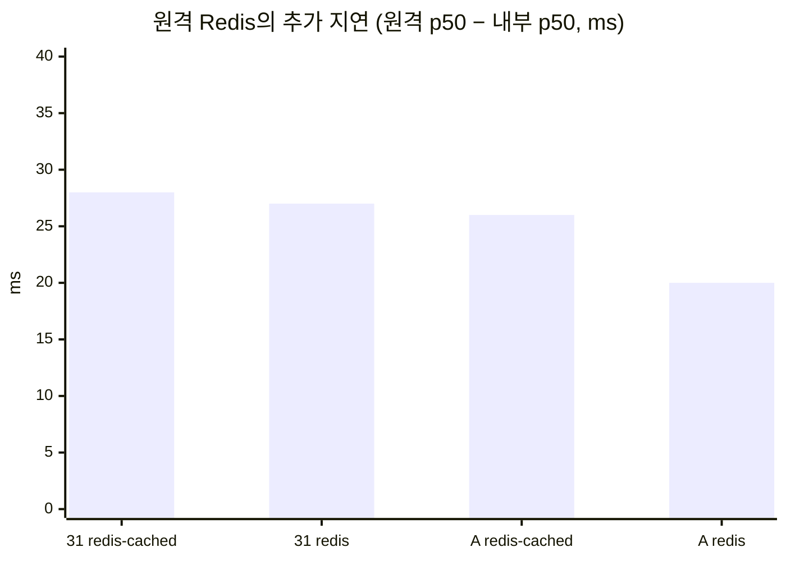
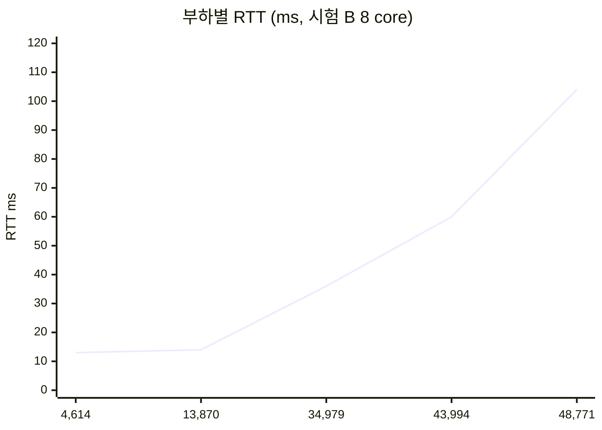

# 결론 4: 원격 Redis가 추가하는 지연

[시나리오 31-B](../31b-maas-remote-redis-high-load.md) 6장 결론 4의 근거를 기술한다.

## 결론

원격 Redis는 요청당 약 RTT × 2(본 환경 +20–28 ms)의 지연을 더한다. 약 14,000 req/s까지는 부하가 늘어도 이 값은 커지지 않으며, 운영 상한(약 35,000 req/s)에서는 RTT가 36 ms로 늘어 추가 지연이 약 70 ms까지 증가한다.

## 근거

### 1) 추가 지연은 RTT × 2이다

Limitador는 요청 1건당 Redis에 2회 왕복한다(쿼터 판정, 사용량 보고). RTT 약 13 ms이므로 약 26 ms가 예상되며, 실측과 일치한다.

| 측정 | 부하 | 내부 Redis p50 | 원격 Redis p50 | 차이 |
|---|---|---|---|---|
| 시나리오 31, `redis-cached` (R1 vs R2) | 약 60 req/s | 236 ms | 264 ms | +28 ms |
| 시나리오 31, `redis` (R4 vs R3) | 약 60 req/s | 236 ms | 263 ms | +27 ms |
| 시험 A, `redis-cached` | 210–246 req/s | 104 ms | 130 ms | +26 ms |
| 시험 A, `redis` | 223–243 req/s | 104 ms | 124 ms | +20 ms |



### 2) 약 14,000 req/s까지 RTT는 유지된다

| 측정 | 부하 (MaaS 환산) | Redis 응답 지표 |
|---|---|---|
| 유휴 | 0 | RTT 11–14 ms |
| 시나리오 31 R2 | 59 req/s | RTT 12.8 ms |
| 시험 A | 210 req/s | RTT 12.6 ms |
| 시험 B 8 core, 100 연결 | 13,870 req/s | RTT 14 ms, p50 12.7 ms |
| 시험 B 8 core, 400 연결 | 34,979 req/s | RTT 36 ms, p50 20.4 ms |

약 14,000 req/s까지 RTT는 유휴 시와 같아 추가 지연은 회선 거리로만 정해진다. 약 35,000 req/s에서는 RTT가 36 ms로 늘어, 추가 지연(RTT × 2)은 약 70 ms가 된다. 이는 Limitador 응답 한도(100 ms) 이내이다.



x축은 MaaS 환산 req/s이다.

### 3) 저장소 방식과 무관하다

`redis-cached`와 `redis`의 p50 차이는 1–6 ms로 측정 오차 범위이다. 본 구성(TokenRateLimitPolicy)에서는 두 방식 모두 요청 처리 중 Redis 왕복이 동기적으로 발생한다.

## 한계

- 운영 상한을 넘으면 RTT가 60 ms(8 core 800 연결), 104 ms(1,600 연결)로 증가한다([결론 5](05-operating-limit.md)).
- 체감 영향은 응답 길이에 따라 다르다. 약 240 ms 응답에서 약 12%, 수 초 단위 LLM 응답에서 1% 내외이다.

```sh
oc get limitador limitador -n kuadrant-system -o jsonpath='{.spec.storage}'
oc exec -n <redis-namespace> deploy/redis -- redis-cli --tls --insecure --latency -h <redis-host>   # RTT
```

원본: `harness/results/scenario31/2026-10-09-r1-r4-comparison.log`, `harness/results/scenario31b/2026-10-09-controls-c32.log`, `20261009-202227-redis-bench-cpu8.log`
