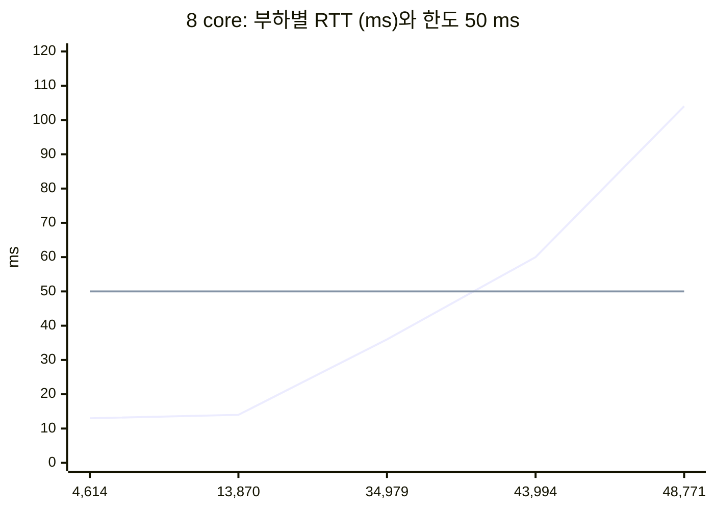

# 결론 5: 운영 상한

[시나리오 31-B](../31b-maas-remote-redis-high-load.md) 6장 결론 5의 근거를 기술한다.

## 결론

Redis 1대(CPU 4 core 이상)의 운영 상한은 약 35,000 req/s(46.7 MB/s)로 둔다. 그 이상에서는 RTT가 50 ms를 넘어 Limitador 응답이 100 ms 한도에 이르며, 한도를 넘으면 쿼터 검사 없이 요청이 통과한다. CPU limit 1 core에서는 약 16,000 req/s이다.

## 근거

### 1) 운영 상한의 기준

Limitador는 요청당 Redis에 2회 왕복한다. Limitador 응답 한도가 100 ms이므로 Redis RTT는 50 ms 이하여야 한다. 운영 상한은 RTT가 50 ms 이하이고 p50이 증가하기 전인 마지막 측정점으로 정한다.

### 2) 시험 B 측정값

| 연결 수 | 8 core req/s | p50 ms | RTT ms | 판정 |
|---|---|---|---|---|
| 25 | 4,614 | 12.1 | 13 | 정상 |
| 100 | 13,870 | 12.7 | 14 | 정상 |
| 400 | **34,979** | 20.4 | 36 | **정상 (상한)** |
| 800 | 43,994 | 39.1 | 60 | RTT 50 ms 초과 |
| 1,600 | 48,771 | 81.8 | 104 | 포화 |



x축은 MaaS 환산 req/s이다. 수평선은 RTT 한도(50 ms = Limitador 한도 100 ms ÷ 2)이며, 약 35,000 req/s와 44,000 req/s 사이에서 한도를 넘는다.

| 연결 수 | 1 core req/s | p50 ms | RTT ms | 판정 |
|---|---|---|---|---|
| 100 | **16,165** | 13.2 | 17 | **정상 (상한)** |
| 400 | 29,635 | 31.8 | 50 | 한도 경계 |
| 1,600 | 31,610 | 131.1 | 263 | 포화 |

- 4 core의 400 연결(38,795 req/s, p50 20.7 ms, RTT 36 ms)도 같은 판정이다. 보수적으로 8 core 값을 상한으로 둔다.
- 400–800 연결 사이는 측정하지 않았다.

### 3) 상한 초과 시 쿼터가 무력화된다

| 서비스 | timeout | failureMode | 초과 시 |
|---|---|---|---|
| `ratelimit-check/report-service` (Limitador) | 100 ms | `allow` | **쿼터 검사 없이 통과** |
| `auth-service` (Authorino) | 200 ms | `deny` | HTTP 500 |

```sh
oc get envoyfilter kuadrant-maas-default-gateway -n openshift-ingress -o yaml   # services: timeout, failureMode
```

이때 오류가 발생하지 않으므로 사용자와 운영자 모두 쿼터 미집행을 인지하기 어렵다.

## 한계

- 시험 B는 `redis-benchmark`로 부하를 가하였다. 명령마다 1.3 KB key를 보내 실제 Limitador보다 무거우므로 상한은 보수적인 값이다.
- 운영 중에는 RTT를 감시하여 상한 접근을 판단한다.

```sh
oc exec -n <redis-namespace> deploy/redis -- sh -c 'redis-cli --tls --insecure -a "$REDIS_PASSWORD" --no-auth-warning --latency'
```

원본: `harness/results/scenario31b/20261009-090331-redis-bench.log`(1 core), `20261009-192848-redis-bench-cpu4.log`, `20261009-202227-redis-bench-cpu8.log`
