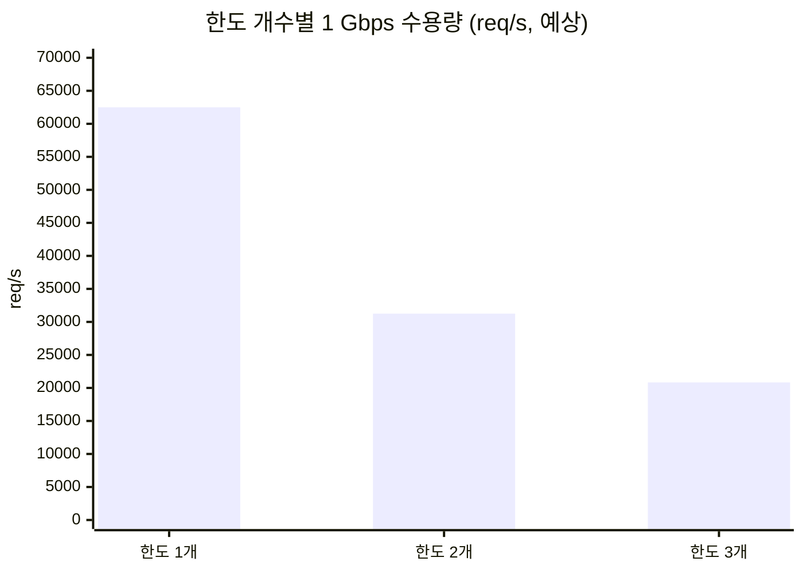

# 결론 6: 수치의 적용 범위

[시나리오 31-B](../31b-maas-remote-redis-high-load.md) 6장 결론 6의 근거를 기술한다.

## 결론

결론 1–5의 수치는 요청 1건이 모델 1개를 호출하고, 구독의 한도가 1개(토큰 한도)인 경우에 한하여 유효하다.

## 근거

### 1) 요청당 Redis 명령 3개는 한도 구성에서 결정된다

| 명령 | 역할 |
|---|---|
| `EVALSHA` | 쿼터 판정 (Lua script) |
| `INCRBY` | 사용 토큰 반영 |
| `GET` | 현재 사용량 조회 |

본 시험의 구독(`maas-load-sub`)은 토큰 한도 1개이며, 요청당 명령 수는 시나리오 31과 시험 A 모두 3.00으로 측정되었다.

### 2) 한도 구성이 바뀌면 수치가 바뀐다

| 구성 | 요청당 명령 수 | 영향 |
|---|---|---|
| 한도 1개 (본 시험) | 3 | 결론 1–5 그대로 적용 |
| 한도 여러 개 (예: 분당 + 일당) | 증가 가능 | 요청당 트래픽 증가, 수용 요청량 감소 |
| 요청 수 한도 병행 (RateLimitPolicy) | 증가 가능 | 〃 |

요청당 명령 수와 트래픽이 k배가 되면 회선 수용량과 Redis 경로 상한은 약 1/k이 된다.



요청당 트래픽이 한도 개수에 비례한다고 가정한 예상값이다(사용률 70%).

## 적용 방법

고객 환경의 구독 구성으로 부하를 가하고 다음을 측정하여 [결론 1](01-capacity-formula.md)의 식에 대입한다.

```sh
oc get tokenratelimitpolicy,ratelimitpolicy -A                                  # 한도 구성 확인
oc exec -n <redis-namespace> deploy/redis -- redis-cli INFO commandstats        # 부하 전후 calls 차이 ÷ 요청 수
oc exec -n <redis-namespace> deploy/redis -- redis-cli INFO stats | grep total_net_
```
