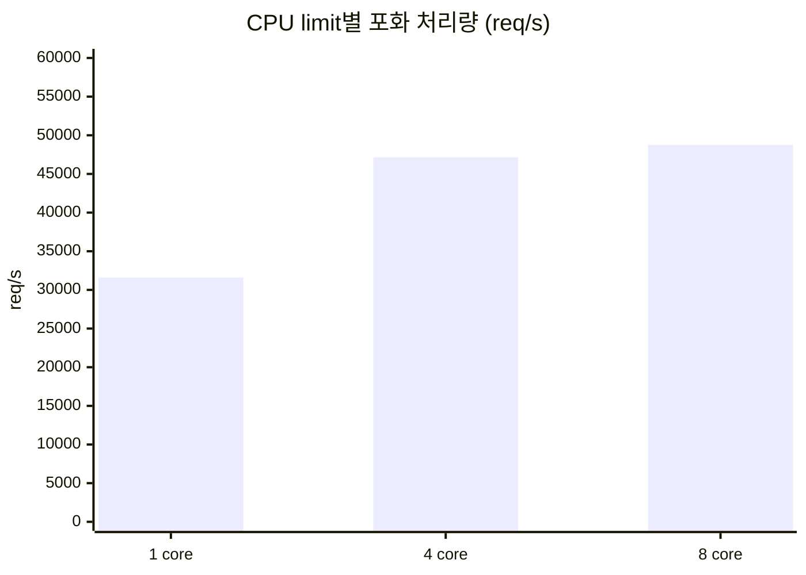

# 결론 7: 원격 Redis 자원 산정

[시나리오 31-B](../31b-maas-remote-redis-high-load.md) 6장 결론 7의 근거를 기술한다.

## 결론

원격 Redis는 CPU 4 core(`io-threads 4`)로 두며, 그 이상의 CPU는 처리량을 늘리지 않는다. Limitador의 데이터는 1 MB 수준이므로 memory는 연결 buffer와 AOF rewrite의 fork 여유를 기준으로 산정한다.

## 근거

### 1) CPU: 4 core 이상에서 처리량이 수렴한다

| CPU limit | 포화 처리량 (req/s) | 포화 시 CPU | throttling |
|---|---|---|---|
| 1 core | 31,610 | 67% | 미측정 |
| 4 core, io-threads 4 | 47,154 | 314% | 27–32% |
| 8 core, io-threads 4 | 48,771 | 329% | 0% |



- 1 → 4 core에서 처리량은 +49%, 4 → 8 core에서 +3%이다.
- 상한은 명령 실행 thread(main) 1개의 포화(0.95 core)로 결정된다.
- `io-threads` 3개는 대기 중에도 busy-wait로 각 약 0.9 core를 점유한다. CPU limit은 main 1 + io-thread 수 이상으로 둔다.

### 2) memory: 강제 종료는 벤치마크 데이터에 의한 것이다

| 관찰 | 값 |
|---|---|
| memory limit | 512Mi |
| 3,200 연결 부하 중 | Redis 강제 종료 (exit 137, SIGKILL), Pod 재시작 |
| 직전 로그 | AOF rewrite가 1초 간격으로 반복, fork CoW 52–84 MB |
| 시험 후 Redis 데이터 | 155,491 key, 154 MB (벤치마크가 생성한 1.3 KB key) |
| 시험 후 RSS | 264 MB (limit의 52%) |
| Limitador 실사용 데이터 | 카운터 25개, 1.23 MB (시나리오 31) |

- 벤치마크 데이터(154 MB), 3,200 연결의 TLS buffer, AOF rewrite의 fork가 겹쳐 512Mi를 초과하였다.
- 실제 Limitador 데이터는 벤치마크의 약 1/125이므로, 운영 환경에서 같은 조건이 발생할 가능성은 낮다.
- 연결 수별 memory 사용량은 측정하지 않았다.
- memory limit 초과 시 Pod가 재시작되며, 그동안 Limitador는 Redis에 접근하지 못한다([시나리오 32](../32-maas-remote-redis-failure.md)).

## 권장 자원

| 항목 | 값 | 근거 |
|---|---|---|
| CPU limit / request | 4 core | 4 core 이상에서 처리량 수렴 |
| `io-threads` | 4 | TLS·socket 처리 분산 |
| memory limit | 1Gi (권장) | 데이터 1 MB 수준. 연결 buffer와 AOF rewrite fork 여유. 적정값은 미측정 |
| 처리량 요구 > 약 35,000 req/s | Redis Cluster | Redis 1대 운영 상한([결론 5](05-operating-limit.md)) |

```sh
oc set resources deploy/redis -n <redis-namespace> --limits=cpu=4,memory=1Gi --requests=cpu=4,memory=1Gi
oc get pod -n <redis-namespace> -l app=redis -o jsonpath='{.items[0].status.containerStatuses[0].lastState}'   # 강제 종료 이력
oc exec -n <redis-namespace> deploy/redis -- sh -c 'cat /sys/fs/cgroup/cpu.stat'                                # nr_throttled
```

원본: `harness/results/scenario31b/20261009-192848-redis-bench-cpu4.log`, `20261009-202227-redis-bench-cpu8.log`
