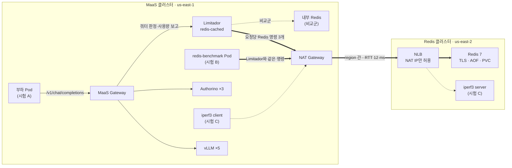
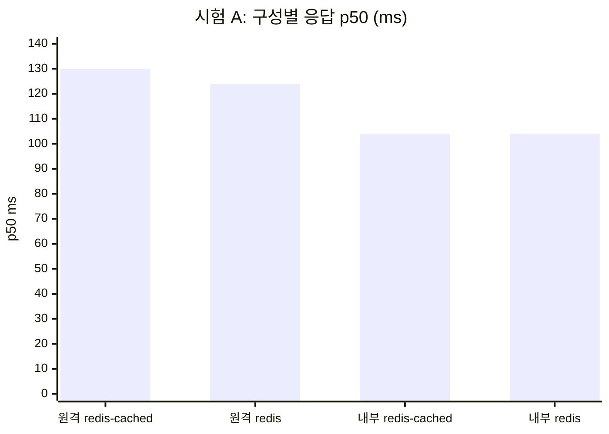
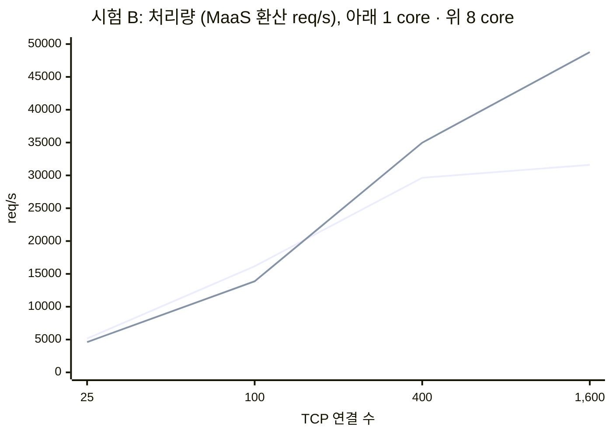
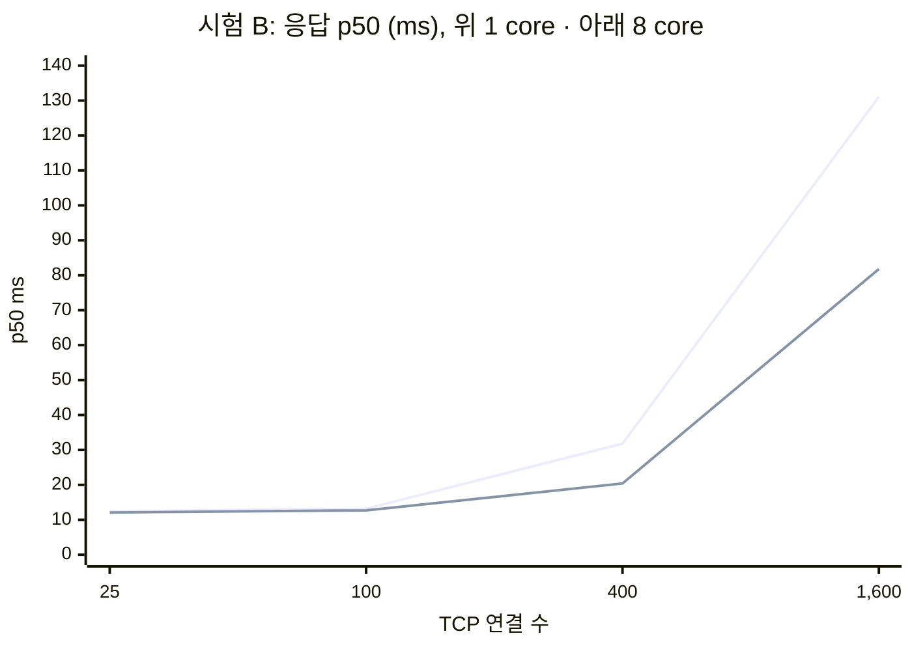

# 시나리오 31-B: 원격 데이터센터 Redis의 고부하 수용성

**모듈:** 서빙 및 추론 > MaaS
**지원 단계:** GA (RHOAI 3.5, RHCL 1.4)
**관련 문서:** [시나리오 31](31-maas-remote-redis-latency.md), [시험 중 발견 사항](31b-maas-remote-redis-latency-lessonlearn.md)

## 1. 목표

MaaS의 쿼터 저장소(Limitador의 Redis)를 다른 데이터센터에 둘 때, 데이터센터 간 회선이 **1 Gbps 또는 10 Gbps이면 고부하 트래픽을 수용할 수 있는지** 실측으로 판정한다.

| 확인 항목 | 시험 |
|---|---|
| 원격 Redis가 MaaS 응답 시간에 주는 영향 | A |
| 원격 Redis와 회선이 처리할 수 있는 최대 요청량 | B |
| 데이터센터 간 회선의 실제 대역폭 | C |

### 전제

본 문서의 수치는 **요청 1건이 모델 1개를 호출하고, 구독의 한도가 1개(토큰 한도)인 경우**를 전제로 한다.
이 조건에서 Limitador는 MaaS 요청 1건당 Redis 명령을 **정확히 3개** 발생시킨다(시험 A 실측, 5.1절).
따라서 Redis 처리량을 MaaS 요청량으로 환산할 때 **Redis 명령/s ÷ 3**을 사용한다.

| 실측 근거 | 성공 MaaS 요청 | `EVALSHA` | `INCRBY` | `GET` | 요청당 명령 |
|---|---|---|---|---|---|
| 원격 Redis, 59 req/s · 0.08 MB/s (시나리오 31 R2) | 10,537 | 10,537 | 10,537 | 10,537 | 3.00 |
| 내부 Redis, 65 req/s · 0.09 MB/s (시나리오 31 R1) | 11,643 | 11,643 | 11,643 | 11,643 | 3.00 |
| 원격 Redis, 211 req/s · 0.26 MB/s (시험 A) | 32,565 | — | — | — | 3.00 |

한 구독에 한도가 여러 개(예: 분당 + 일당)이거나 요청 수 한도를 함께 쓰면 요청당 명령 수가 늘어날 수 있다. 이 경우 고객 환경에서 측정한 값을 3 대신 사용한다.

```sh
oc exec -n <redis-namespace> deploy/redis -- redis-cli INFO commandstats   # 부하 전후 calls 차이 ÷ 요청 수
```

## 2. 환경

### 1) MaaS

| 항목 | 값 |
|---|---|
| 클러스터 | sandbox5408, AWS `us-east-1`, OpenShift 4.22.17 |
| 제품 | RHOAI 3.5.1, RHCL 1.4.3 (Limitador operator 1.4.2, Authorino operator 1.4.3) |
| 모델 | `maas-demo/maas-demo-model` (`Qwen2.5-1.5B-Instruct`), replica 5 (NVIDIA L4 1 + A10G 4) |
| Limitador | `kuadrant-system/limitador`, replica 1, `spec.storage.redis-cached` (flush 500 ms) |
| Authorino | 시험 A: replica 3 (기본 1에서 확장). 이후 6으로 추가 확장하였으나 효과 없음([발견 사항](31b-maas-remote-redis-latency-lessonlearn.md) 1.3). 시험 B·C는 Authorino를 거치지 않음 |
| client | 클러스터 내 부하 Pod, MaaS API key 20개(주체 20 = Limitador 카운터 20) |

### 2) Redis

| 항목 | 값 |
|---|---|
| 클러스터 | sandbox5373, AWS `us-east-2` (MaaS와 다른 region) |
| 배포 | `remote-redis/redis`, Redis 7.2.16 (`registry.redhat.io/rhel9/redis-7`), Pod 1개 |
| 자원 | 시험 A: CPU limit 1 core. 시험 B: CPU limit 1 / 4 / 8 core(4·8 core는 `io-threads 4`), memory limit 512Mi |
| 보안 | TLS(`rediss://`), 비밀번호(ACL `default` 사용자) |
| 영속성 | AOF(`appendfsync everysec`), PVC 1 Gi, `maxmemory-policy noeviction` |
| 노출 | Service `type: LoadBalancer`(AWS NLB), `loadBalancerSourceRanges` = MaaS 클러스터 NAT IP |
| 비교군 | MaaS 클러스터 내부 Redis `kuadrant-system/limitador-redis` |

### 3) Network bandwidth

| 항목 | 값 |
|---|---|
| 경로 | Limitador Pod → NAT Gateway → AWS region 간 backbone → NLB → Redis Pod |
| RTT (유휴) | 11–14 ms (`redis-cli --latency`) |
| 경로 최대 대역폭 | **약 6.9–8.5 Gbps** (iperf3 실측, 방향별 MaaS → Redis 6,870 Mbps, Redis → MaaS 8,528 Mbps) |
| Limitador 실사용 | 최대 약 0.38 MB/s(약 3 Mbps), 경로 최대의 0.04% |

회선의 대역폭은 회선이 정한다. TCP 연결 1개는 왕복 지연 때문에 회선을 다 채우지 못하므로(본 경로에서 연결 1개 약 1.6–1.7 Gbps), 경로 최대 대역폭은 여러 연결을 동시에 보내 측정하였다.

## 3. 구성도



## 4. 시나리오 설명

부하의 크기는 **부하를 받는 서버가 초당 처리한 양**으로 표기한다.

| 시험 | 목적 | 방법 | 서버가 받은 부하 | 시간 |
|---|---|---|---|---|
| **A. MaaS 실경로** | 원격 Redis가 응답 시간·처리량에 주는 영향 | 실제 MaaS 요청을 보내고, Redis 위치(내부/원격)와 저장소 방식(`redis-cached`/`redis`)을 바꿔 비교 | MaaS **210–246 req/s (Redis 트래픽 0.26–0.31 MB/s)**, Redis 630–740 명령/s | 120초 |
| **B. Redis 한계** | 원격 Redis와 회선이 처리하는 최대 요청량 | 같은 회선으로 원격 Redis에 Limitador와 같은 명령(Lua script + `INCRBY` + `GET`, key 1.3 KB)을 직접 가하며 4단계로 증가 | Redis CPU limit 1 / 4 / 8 core에서 각각 최대 **94,832 / 141,463 / 146,313 명령/s** (MaaS 환산 31,610 / 47,154 / 48,771 req/s) | 단계별 약 1분 |
| **C. 회선 대역폭** | 회선의 실제 전송 용량 | iperf3를 같은 경로(NAT → NLB)로 측정 | 최대 8.5 Gbps | 15초 |

| 용어 | 의미 |
|---|---|
| MaaS req/s | MaaS Gateway가 초당 처리한 추론 요청 수 |
| Redis 명령/s | 원격 Redis가 초당 처리한 명령 수 |
| MaaS 환산 req/s | Redis 명령/s ÷ 3 (1장 전제) |
| Redis 트래픽 (MB/s) | 데이터센터 간 Limitador ↔ Redis 송수신 합계. 1 MB = 1,024 KB = 1,048,576 byte, 요청당 약 1.37 KB(1,400 byte) |

부하 발생 client는 다음과 같다(부하 크기는 위 서버 측 값으로 판단한다).

| 시험 | client |
|---|---|
| A | 부하 Pod 2개 × multi-process 16개 = multi-process 32개. 각 process가 요청 → 응답 수신 → 다음 요청을 반복. `max_tokens: 1`, MaaS API key 20개 |
| B | `redis-benchmark` Pod 4개(1 core) / 8개(4·8 core). 단계별 TCP 연결 25 / 100 / 400 / (800) / 1,600개, 연결당 명령 8개 연속 전송(pipelining) |

시험 B를 별도로 둔 이유: MaaS 실경로는 약 285 req/s(Redis 트래픽 약 0.38 MB/s)에서 인증 단계가 먼저 포화되어(발견 사항 문서 참조) Redis 한계까지 부하를 올릴 수 없다.

```sh
# 시험 A
LOAD_LABEL=A CONCURRENCY=32 LOAD_PODS=2 MAX_TOKENS=1 DURATION=120 bash harness/remote/scenario31-remote-redis-load.sh
REDIS_ACTION=mode REDIS_MODE=redis bash harness/remote/scenario31-limitador-redis-switch.sh   # 저장소 방식 전환
REDIS_ACTION=restore bash harness/remote/scenario31-limitador-redis-switch.sh                # 내부 Redis로 전환
# 시험 B
BENCH_STEPS="25 100 400 1600" BENCH_PODS=4 BENCH_ROUNDS=500 bash harness/remote/scenario31b-redis-bench.sh             # 1 core
REDIS_CPU=8 REDIS_CPU_REQUEST=8 REDIS_IO_THREADS=4 bash harness/remote/scenario31-remote-redis-up.sh            # 원격 클러스터: Redis 자원 변경
REDIS_CONTEXT=<원격 context> BENCH_STEPS="25 100 400 800 1600" BENCH_PODS=8 BENCH_ROUNDS=500 bash harness/remote/scenario31b-redis-bench.sh   # throttling 포함
# 시험 C (원격 클러스터에서 server-up, MaaS 클러스터에서 client)
BW_ACTION=server-up ALLOWED_CIDRS=<NAT IP>/32,... bash harness/remote/scenario31b-bandwidth.sh
BW_ACTION=client BW_HOST=<NLB> bash harness/remote/scenario31b-bandwidth.sh
```

## 5. 결과

원본 데이터: `harness/results/scenario31b/`

### 5.1 시험 A: MaaS 실경로 (MaaS 210–246 req/s, Redis 트래픽 0.26–0.31 MB/s)

| Redis | 방식 | 성공률 | 처리 부하 (성공 req/s) | Redis 트래픽 (MB/s) | p50 / p95 / p99 ms | Redis 명령/요청 | 부하 중 RTT ms |
|---|---|---|---|---|---|---|---|
| 원격 | `redis-cached` | 99.6% | 210 | 0.26 | 130 / 179 / 212 | 3.00 | 12.6 |
| 원격 | `redis` | 99.9% | 223 | 0.28 | 124 / 165 / 193 | 3.00 | 12.6 |
| 내부 | `redis-cached` | 99.4% | 246 | 0.31 | 104 / 168 / 222 | 2.98 | 1.4 |
| 내부 | `redis` | 99.2% | 243 | 0.30 | 104 / 173 / 228 | 2.98 | 1.4 |



- 원격 Redis는 p50 기준 요청당 **+20–26 ms**(≈ RTT × 2)를 더한다. p95·p99 차이는 일정하지 않다.
- `redis`와 `redis-cached`의 차이는 측정 오차 범위이다.
- 요청당 Redis 트래픽은 약 **1.4 KB**이다. KB는 KiloByte(1 KB = 1,024 byte)이며, Redis 트래픽은 데이터센터 간 Limitador ↔ Redis 송수신 합계이다(client ↔ Gateway의 HTTP 본문은 제외).
- **Redis 트래픽은 요청당 토큰 수와 무관하다.** 토큰 수는 `INCRBY`의 증가값으로만 전달되므로, 토큰이 많아도 요청당 명령 수(3개)와 트래픽(약 1.4 KB)은 같다.

### 5.2 시험 B: 원격 Redis 한계

Redis Pod의 CPU limit을 1 / 4 / 8 core로 바꾸어 같은 부하를 가하였다. 4·8 core는 `io-threads 4`를 함께 설정하였다.

| 연결 수 | 1 core req/s | 1 core p50 ms | 4 core req/s | 4 core p50 ms | 8 core req/s | 8 core p50 ms | 8 core RTT ms |
|---|---|---|---|---|---|---|---|
| 25 | 5,151 | 12.4 | 4,493 | 12.2 | 4,614 | 12.1 | 13 |
| 100 | **16,165** | 13.2 | 14,225 | 12.5 | 13,870 | 12.7 | 14 |
| 400 | 29,635 | 31.8 | 38,795 | 20.7 | **34,979** | 20.4 | 36 |
| 800 | — | — | — | — | 43,994 | 39.1 | 60 |
| 1,600 | **31,610** | 131.1 | **47,154** | 85.3 | **48,771** | 81.8 | 104 |

req/s는 MaaS 환산값(Redis 명령/s ÷ 3)이다.

| 사양 | 포화 처리량 (req/s) | 포화 시 Redis 트래픽 (MB/s) | 포화 시 Redis CPU | CPU throttling | 상한 요인 |
|---|---|---|---|---|---|
| 1 core | 31,610 | 42.2 | 67% | 미측정 | CPU limit (추정) |
| 4 core, io-threads 4 | 47,154 | 63.0 | 314% | 27–32% | CPU limit + main thread |
| 8 core, io-threads 4 | **48,771** | **65.1** | 329% | **0%** | **main thread 포화** |

부하 중(8 core, 1,600 연결 재측정: 47,154 req/s, throttling 0%) thread별 CPU는 다음과 같다. 8 core 포화 처리량의 재현 범위는 47,154–48,771 req/s이다.

| thread | CPU | 역할 |
|---|---|---|
| `redis-server` (main) | **0.95 core** | 명령 실행 (단일 thread) |
| `io_thd_1`–`3` | 각 0.92 core | socket·TLS 읽기/쓰기. 대기 중에도 busy-wait로 CPU를 점유 |
| `bio_aof` | 0.04 core | AOF 기록 |

```sh
oc exec -n <redis-namespace> deploy/redis -- sh -c 'cat /sys/fs/cgroup/cpu.stat'            # nr_throttled
oc exec -n <redis-namespace> deploy/redis -- sh -c 'for t in /proc/1/task/*; do echo "$(cat $t/comm) $(cut -d" " -f14,15 $t/stat)"; done'   # thread별 CPU tick
```





- 1 core의 상한(약 31,600 req/s)은 시험용 Redis의 CPU limit에 의한 값이었다.
- 8 core에서는 throttling이 0%이나 처리량은 4 core와 같은 약 48,800 req/s에서 포화된다. main thread가 0.95 core로 포화되었으며, 이는 **Redis 1대(단일 명령 실행 thread)의 상한**이다. CPU limit을 4 core 이상으로 늘려도 처리량은 증가하지 않는다.
- 400 연결(약 35,000 req/s)까지 p50이 약 20 ms로 유지되며, 800 연결부터 RTT가 50 ms를 넘는다.
- 3,200 연결에서 Redis가 memory limit(512Mi)을 넘어 강제 종료(exit 137)되었다. 벤치마크가 생성한 데이터(154 MB)에 의한 것으로, 실제 Limitador 데이터(1.23 MB)와는 무관하다([발견 사항](31b-maas-remote-redis-latency-lessonlearn.md) 8장).
- 벤치마크는 명령마다 1.3 KB key를 보내 실제 Limitador보다 무겁다. 회선 사용량은 Limitador 환산값(req/s × 1,400 byte)으로 판단한다.

### 5.3 시험 C: 회선 대역폭

경로 최대 대역폭은 약 6.9–8.5 Gbps이다(2장 3)). Limitador의 실사용량(최대 약 3 Mbps)은 이 값의 0.04%이다.

### 5.4 회선 대역폭으로 수용 가능한 요청량

```text
최대 요청량 (req/s) = 회선 대역폭 (bit/s) × 사용률 ÷ (요청당 Redis 트래픽 (byte) × 8)
```

회선 사용량은 요청 수에 비례하며, 요청당 토큰 수와 무관하다.

| 변수 | 값 | 근거 |
|---|---|---|
| 요청당 Redis 트래픽 | 약 1,400 byte | 실측 1,388–1,397 byte, 송수신 합계 (5.1절, 시나리오 31) |
| 사용률 | 70% 권장 | 회선 포화 시 지연 급증을 피하기 위한 여유 |

| 회선 | 이론 최대 (100%) | 권장 운영 (70%) |
|---|---|---|
| 1 Gbps | 약 89,000 req/s (118.8 MB/s) | 약 62,500 req/s (83.4 MB/s) |
| 10 Gbps | 약 893,000 req/s (1,192.1 MB/s) | 약 625,000 req/s (834.5 MB/s) |

- Limitador 처리 한계가 없다고 가정한 회선 기준 값이다. 실측에서 Redis 1대는 약 48,800 req/s(65.1 MB/s, Limitador 기준 546 Mbps)에서 먼저 포화되었다(5.2절).
- 요청당 Redis 트래픽은 1장 전제에서의 값이다. 고객 환경에서는 다음으로 측정하여 대입한다.

```text
요청당 Redis 트래픽 = 부하 중 Redis 송수신 byte 증가분 ÷ 처리한 MaaS 요청 수
```

```sh
oc exec -n <redis-namespace> deploy/redis -- redis-cli INFO stats | grep total_net_   # 부하 전후 비교
```

## 6. 결론

1. **회선이 수용하는 요청량은 `대역폭 × 사용률 ÷ (요청당 Redis 트래픽 × 8)`로 산정한다** (요청당 약 1,400 byte, 5.4절). [근거](31b-conclusions/01-capacity-formula.md)
2. **Redis 1대 구성에서는 1 Gbps 회선으로 충분하다.** 1 Gbps는 권장 운영(70%) 기준 약 62,500 req/s(83.4 MB/s)를 수용하며, Redis 1대의 상한(약 48,800 req/s, 65.1 MB/s)보다 크다. Redis Cluster 등으로 62,500 req/s를 넘기면 1 Gbps가 병목이 된다. [근거](31b-conclusions/02-1gbps-sufficient.md)
3. **10 Gbps 회선은 약 625,000 req/s(834.5 MB/s)를 수용하며, 회선이 병목이 될 가능성은 없다.** 실측 상한(약 48,800 req/s)은 회선이 아닌 Redis main thread에서 발생하였다. [근거](31b-conclusions/03-10gbps-not-bottleneck.md)
4. **원격 Redis는 요청당 약 RTT × 2(본 환경 +20–28 ms)의 지연을 더한다.** 약 14,000 req/s까지 이 값은 커지지 않으며, 운영 상한(약 35,000 req/s)에서는 약 70 ms까지 증가한다. [근거](31b-conclusions/04-remote-redis-latency.md)
5. **Redis 1대(4 core 이상)의 운영 상한은 약 35,000 req/s(46.7 MB/s)로 둔다.** 그 이상에서는 RTT가 50 ms를 넘어 Limitador 응답이 100 ms 한도에 이르며, 한도를 넘으면 쿼터 검사 없이 요청이 통과한다. CPU limit 1 core에서는 약 16,000 req/s이다. [근거](31b-conclusions/05-operating-limit.md)
6. 위 수치는 1장의 전제(요청 1건 = 모델 1개, 구독 한도 1개)에서의 값이다. [근거](31b-conclusions/06-premise.md)
7. **원격 Redis는 CPU 4 core(`io-threads 4`)로 두며, 그 이상의 CPU는 처리량을 늘리지 않는다.** Limitador 데이터는 1 MB 수준이므로 memory는 연결 buffer와 AOF rewrite 여유를 기준으로 산정한다. [근거](31b-conclusions/07-redis-sizing.md)
